<!-- _class: titlepage -->
# Vorlesungsreihe: Virtual Reality (VR)
## Fachlehrer  Stefan Sauer
### THWS Geovisualisierung

---
<!-- _class: structural img-right-->
## Woher und wohin?
> Um zu verstehen, welche technologischen Treiber die AR und VR hat, muss man zuerst die Herkunft und Geschichte virtueller Realitäten kennen.

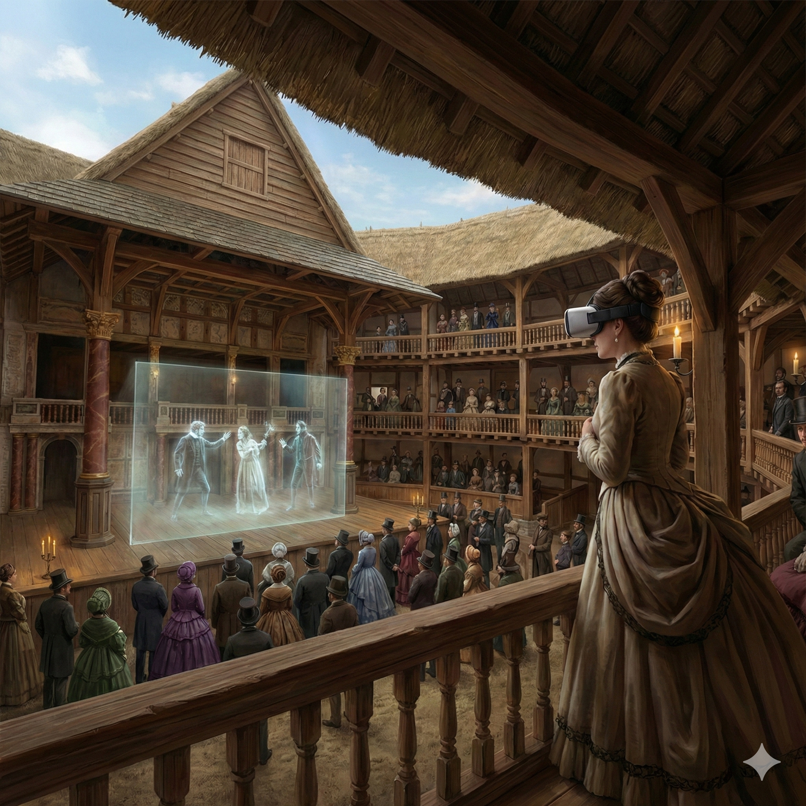

---
# Agenda & Lernziele
1. [Geschichte der AR/VR](#geschichte-der-arvr)
2. [Timeline](#timeline-frühe-phase-bis-1990)
3. [Die Geschichte im Detail](#die-geschichte-im-detail)
4. [Frühe Projektionstechniken](#frühe-projektionstechniken)
5. [VR wird erwachsen](#vr-wird-erwachsen)
6. [Ab in die Zukunft](#ab-in-die-zukunft)

---
<!-- _class: structural -->
# Geschichte der AR/VR

> Die Geschichte der AR und VR ist eng mit der Entwicklung von Computergrafik, Sensorik und Mensch-Maschine-Interaktion verbunden. Sie reicht deutlich weiter zurück, als viele vermuten.

---

- **VR:**
    - zuerst teure Forschungstechnologie
    - dann Massenanwendung.
- **AR:**
    - Blieb lange forschungs- und industriegetrieben,
    - gewann erst mit mobilen Plattformen breitere Relevanz.

---
<!-- _class: structural -->
# Frühe Projektionstechniken
> Die Sehnsucht nach der Entdeckung einer 
---

## Timeline: Frühe Phase bis 1990

- **1589:** Erste Erwähnung von „AR“ (Giambattista Della Porta „Magia Naturalis“)
- **1862:** Geisterhafte Projektionstäuschung (Henry Dircks & John Henry Pepper „Pepper's Ghost“)
- **1960er:** Anfänge der VR (Ivan Sutherland „The Ultimate Display“)
- **1980er:** Erste Systeme & Interaktion
    „Jaron Lanier“ prägt den Begriff VR
- **Ende 1980er / Anfang 1990er:** Technologische Meilensteine & erste komplexe VR-Anwendungen

---

## Timeline: 1990 bis Heute
- **1990er:** Kommerzialisierung & Projektion (Erste VR-Software, CAVE)
- **Frühe 1990er (AR):** Boeing-Projekt (1992)
- **1993-1999:** Haptik & Mobile AR (PHANTOM, MARS & ARToolKit)
- **Um 2000:** Kostensenkung & neue Tracking-Verfahren (Infrarot-Tracking)
- **Ab 2013:** Durchbruch für Konsumenten-VR (Oculus Rift, HTC Vive, PlayStation VR)
- **AR in den 2010ern:** Google Glass
- **Ab 2017:** ARKit, ARCore

---
<!-- _class: structural -->
# Die Geschichte im Detail

---
<!-- _class: img-right-->

## 1589: Erste Erwähnung von „AR“

**Giambattista della Porta**
- Beschreibt in der „Magia Naturalis“ optische Konzepte der Erweiterung der Realität.
- **Experimente mit:**
    - Linsenverzerrungen
    - Perspektivischen Effekten
    - Bildprojektionen
- **Fazit:** Frühform dessen, was AR heute digital berechnet – Transformation realer Wahrnehmung.

---
<!-- _class: img-right-->
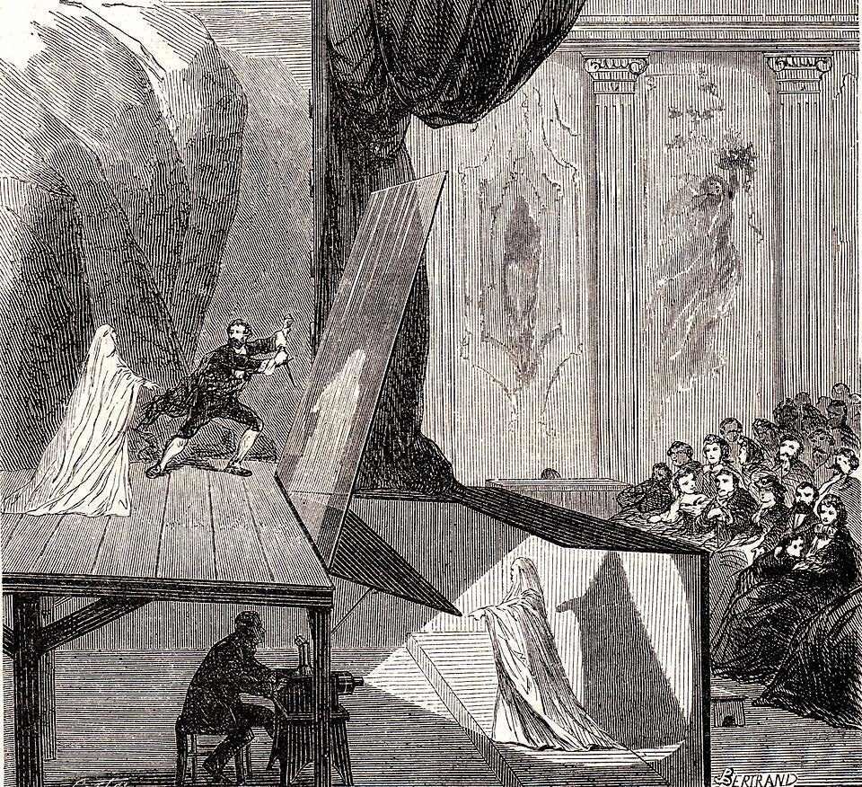

## 1862: Geisterhafte Projektionstäuschung

- **Henry Dircks:** Entwickelt Projektions-Technik für Theater.
- **John Henry Pepper:** Greift die Idee auf und entwickelt „Pepper's Ghost“.
    * Einfache Nutzbarkeit in Theatern.

---
## 1862: Pepper's Ghost

- **Technik:** Optische Illusionstechnik des 19. Jahrhunderts.
- **Funktionsweise:** Nutzt eine schräg gestellte Glasscheibe oder Folie, um ein verborgenes Objekt oder eine Person scheinbar in den realen Raum zu projizieren.
- **Effekt:** Erzeugt den Eindruck eines durchscheinenden „Geistes“, der mit der realen Szene überlagert ist.
- **Bedeutung:** Gilt als analoger Vorläufer von Augmented Reality (Kombination von realer Umgebung und künstlichen Bildinhalten ohne digitale Technik).

---

<video src="img/Pepper-s-Ghost-Effect-Henry-Dircks-and-J_Media_4CVTHLK_37Q_001_1080p.mp4" controls></video>

---
<!-- _class: structural -->
# VR wird erwachsen
> Die Informatik nimmt Einfluss auf die Technologie. Computergraphik und Human Computer Interaction entstehen
---
<!-- _class: img-right-->

## 1960er Jahre: Ivan Sutherland

- Gilt als einer der einflussreichsten Pioniere der Informatik (Computergraphik, VR, AR, HCI).
- **Rolle:**
    * Vordenker statt Produktentwickler.
    * Begründer der interaktiven 3D-Graphik.
    * Geistiger Vater von VR & AR.
    * Einer der ersten, der digitale Welten als Erfahrungsräume gedacht hat.

---

## 1963: Sketchpad

- Entstand als Dissertation am MIT.
- **Meilenstein:** Erstes interaktives Computer-Grafiksystem.
- **Konzepte:**
    - Grafische Objekte, Constraints, Hierarchien.
    - Direkte Manipulation mit Eingabegeräten (Lichtgriffel).
- **Impact:** Ursprung von CAD, GUI und objektorientiertem Denken.

---

<!-- _class: fullscreen -->
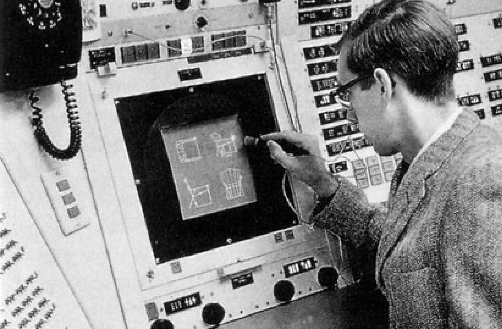

---
<!-- _class: img-right-->

## 1965: The Ultimate Display

- Visionärer Essay von Ivan Sutherland.
- Beschreibt eine vollständig computergenerierte, multisensorische Welt.
- **Idee:** Ein Raum, in dem virtuelle Objekte physisch real erscheinen.
- **Konzeptioneller Ursprung von:**
    - VR / AR
    * Spatial Computing

(https://www.researchgate.net/publication/290527038_The_Ultimate_Display)

---

## 1968: The Sword of Damocles

- Entwicklung des ersten Head-Mounted Displays (HMD).
- **Kombination aus:**
    - 3D-Grafik
    - Head-Tracking
    - Perspektivisch korrekte Darstellung
- **Name:** Wegen der massiven Deckenaufhängung bekannt als „Sword of Damocles“.
- **Besonderheit:** Durch See-Through-Darstellung zugleich ein frühes AR-System.

---

<!-- _class: fullscreen -->
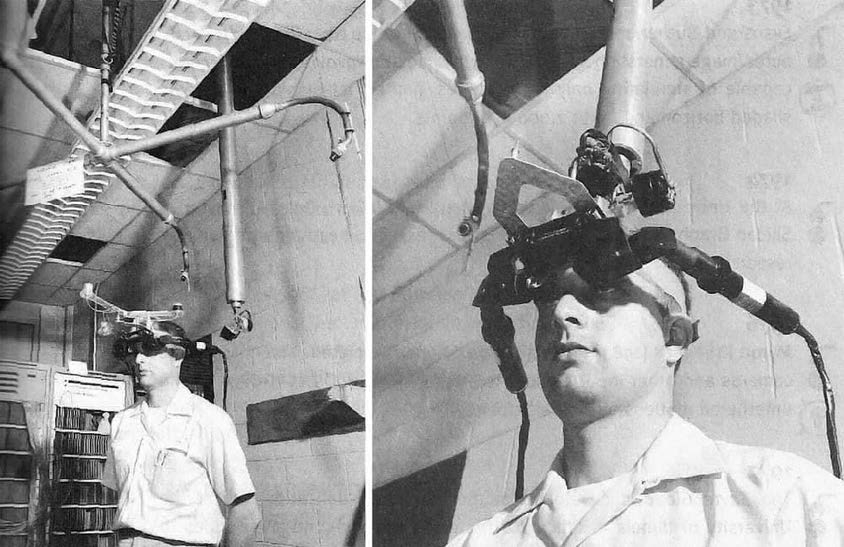

---

<video src="img/Ivan-Sutherland-and-The-Sword-of-Damocle_Media_osH3Bmp-36k_001_1080p.mp4" controls></video>

Link zum Video: The Sword of Damocles
*(https://www.youtube.com/watch?v=osH3Bmp-36k)*

---
<!-- _class: img-right-->
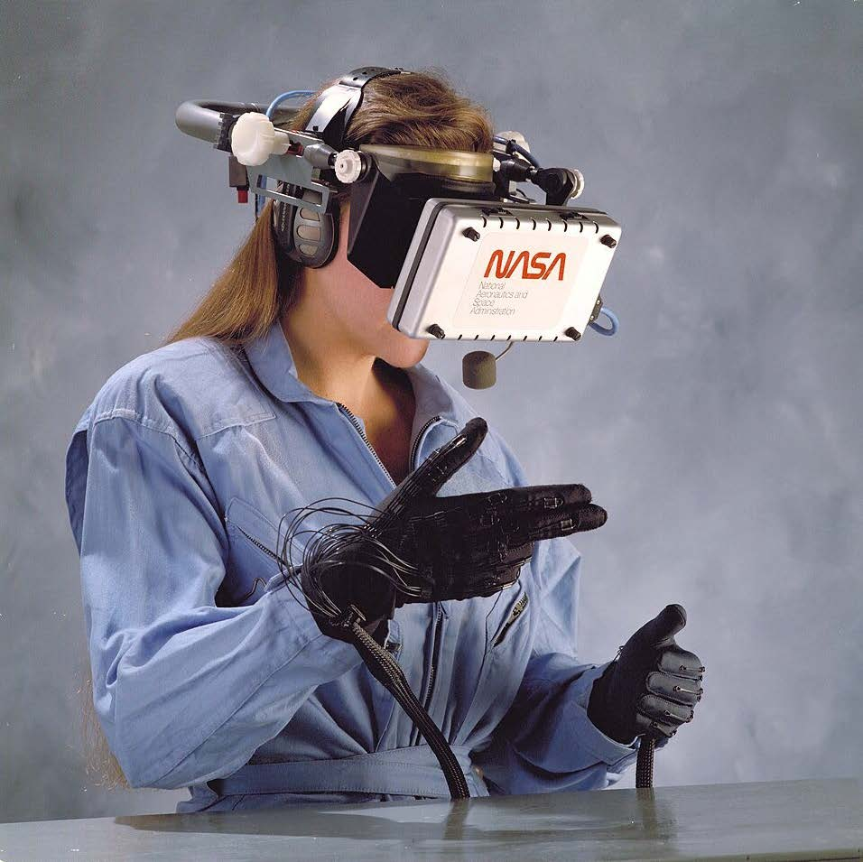
## 1980er Jahre: NASA VIEWlab

- Start 1985 am NASA Ames Research Center.
- **Ziel:** Simulator für die Raumstation und interaktive Experimente.
- **VIEWlab Head-Mounted Display (1988):**
    - Stereoskopische 3D-Darstellung.
    - Reagiert auf Position, Stimme und Gesten.
    - Erlaubt $360^{\circ}$-Erkundung.

<a href="https://immersivearchive.org/nasa-viewlab.html">The Nasa View Lab</a>

---

<!-- _class: fullscreen -->
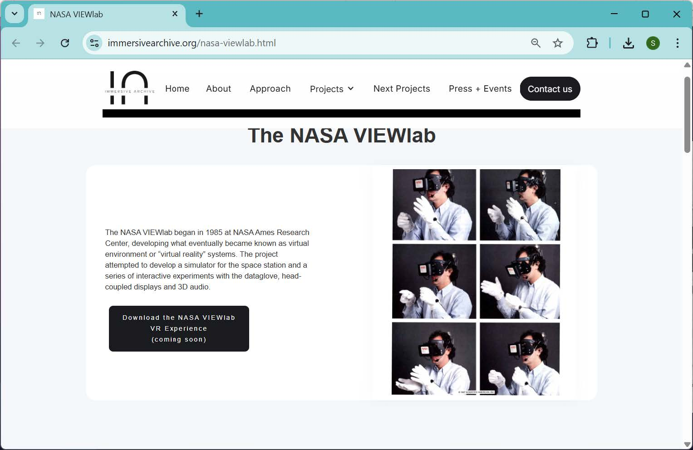

<a href="https://immersivearchive.org/nasa-viewlab.html" style="background: white; padding: 5px;">The Nasa View Lab</a>

---

## NASA VIEWlab Komponenten

- Weitwinkel-Stereoskop-Display
- Datagloves für haptische Eingabe
- Sprach- und Gestenerkennung
- 3D-Audio-Ausgabe
- Grafik- und Video-Generation

**Dataglove (1987) - Jaron Lanier:**
Frühes interaktives Eingabegerät. Misst Fingerbewegungen für 3D-Handtracking.

---
<!-- _class: img-right-->

## 1980er Jahre: Jaron Lanier

- **VR-Pionier:** Gilt als einer der Väter des Begriffs „Virtuelle Realität“.
- **VPL Research (Gründung 1984):** Entwicklung früher VR-Brillen (EyePhones) und Data Glove.
- **Konzepte:** Entwickelte den „Avatar“ (digitale Repräsentation).
- **Bedeutung:** Trug maßgeblich dazu bei, VR über Forschungslabore hinaus bekannt und kommerziell nutzbar zu machen.

###### Von vanz-https://www.flickr.com/photos/vanz/144476323/in/set-72057594131744996/, CC BY 2.0, https://commons.wikimedia.org/w/index.php?curid=1707896

---

<video src="img/DataGlove-A-Hand-Gesture-Interface-Devic_Media_0ERubHhyfkA_001_480p.mp4" controls></video>

Link zum Video: VPL Data Glove
*(https://www.youtube.com/watch?v=osH3Bmp-36k)*

---

<video src="img/Virtual-Reality-from-1990-Jaron-Lanier-E_Media_ACeoMNux_AU_001_480p.mp4" controls></video>

Link zum Video: VPL Eye Phones
*(https://www.youtube.com/watch?v=ACeoMNux_AU&t=4s)*

---
<!-- _class: img-right-->
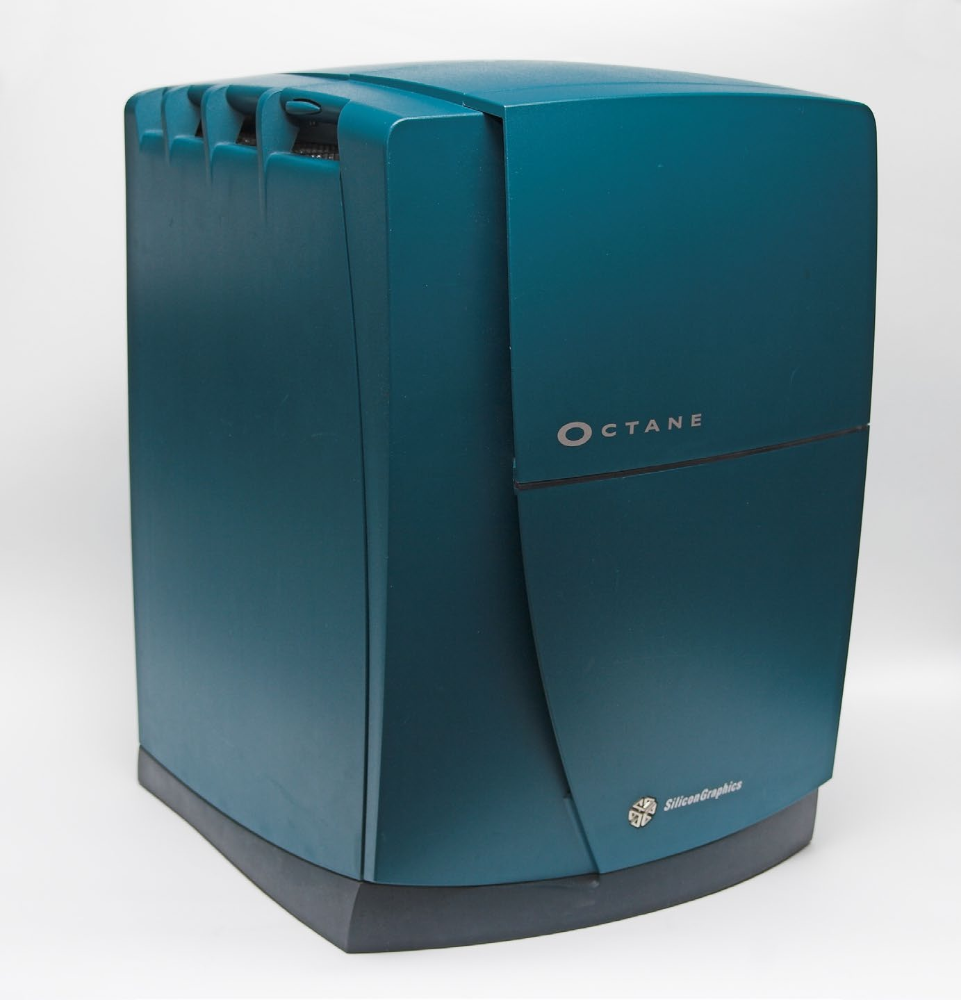

## Ende der 1980er: VPL Insolvenz & Laniers Wandel

- **Gründe für das Scheitern von VPL:**
    - Extrem hohe Hardwarekosten.
    - Begrenzte Rechenleistung (SGI Workstations).
    - Markt war noch nicht bereit.
- **Lanier heute:**
    - Kritischer Denker digitaler Technologien.
    - Fokus auf Menschlichkeit in digitalen Systemen.
    - Kritik an rein datengetriebenen Plattformen.

###### Von Afrank99 (talk) - Eigenes Werk, CC BY-SA 2.0, https://commons.wikimedia.org/w/index.php?curid=70417
---

## 1990er Jahre: Kommerzialisierung & Projektion

- Verbreitung leistungsfähiger Grafik-Workstations (Silicon Graphics).
- **Erste kommerzielle VR-Software:**
    - RB2 (VPL)
    - dVS (Division)
    - World Toolkit (Sense8)

---

## Beispiel Software: Sense8

- **Produkte:** World ToolKit® und World Up®.
- **Features:**
    - Szenengraph-basierte Weltbeschreibung.
    - Echtzeit-Rendering von 3D-Geometrie.
    - Unterstützung von HMDs, Trackern, Datagloves.
    - Kollisionsabfragen und einfache Physik.
- **Einsatz:** Design, Training, Simulation (z.B. Airbus Virtuelles Modell 1995).
http://www.aaronjamesrogers.com/misc/hotmix16/vendors/sense8/index%7E1.htm

---

<!-- _class: fullscreen -->
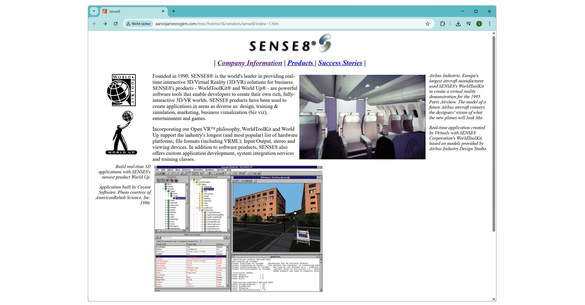

---
<!-- _class: img-right-->
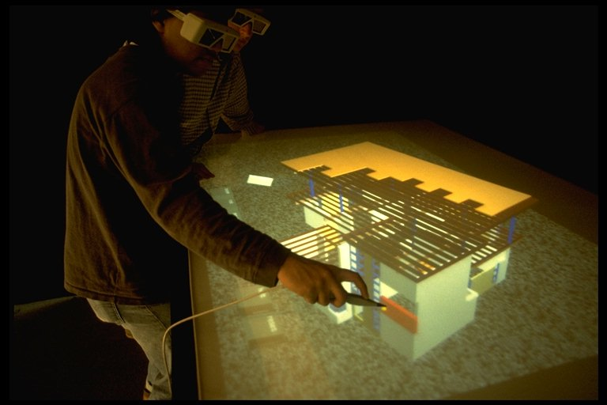

## 1990er Jahre: Projektionsbasierte VR-Systeme

Alternativen zu HMDs entstehen:

- **1994:** Powerwall
- **1992:** CAVE (Cave Automatic Virtual Environment)
- **1993:** Responsive Workbench

###### https://graphics.stanford.edu/projects/RWB/applications.html
---

## 1992: CAVE System

- Entwickelt an der University of Illinois at Chicago.
- **Aufbau:**
    - Raum-große virtuelle Umgebung (3-6 Wände inkl. Boden).
    - Stereoskopische Rückprojektion (Beamer).
- **Funktionsweise:**
    - Nutzer tragen Shutter-Brillen.
    - Head-Tracking steuert die Perspektive.
    - Mehrkanaliges 3D-Audio.
    - Erlaubt Bewegung „um virtuelle Objekte im Raum“.

---

<!-- _class: fullscreen -->
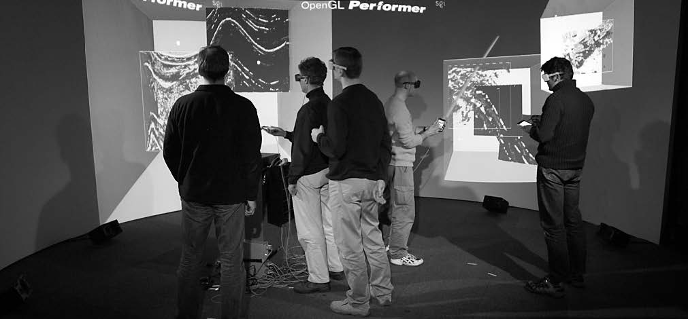

---

<!-- _class: img-right-->
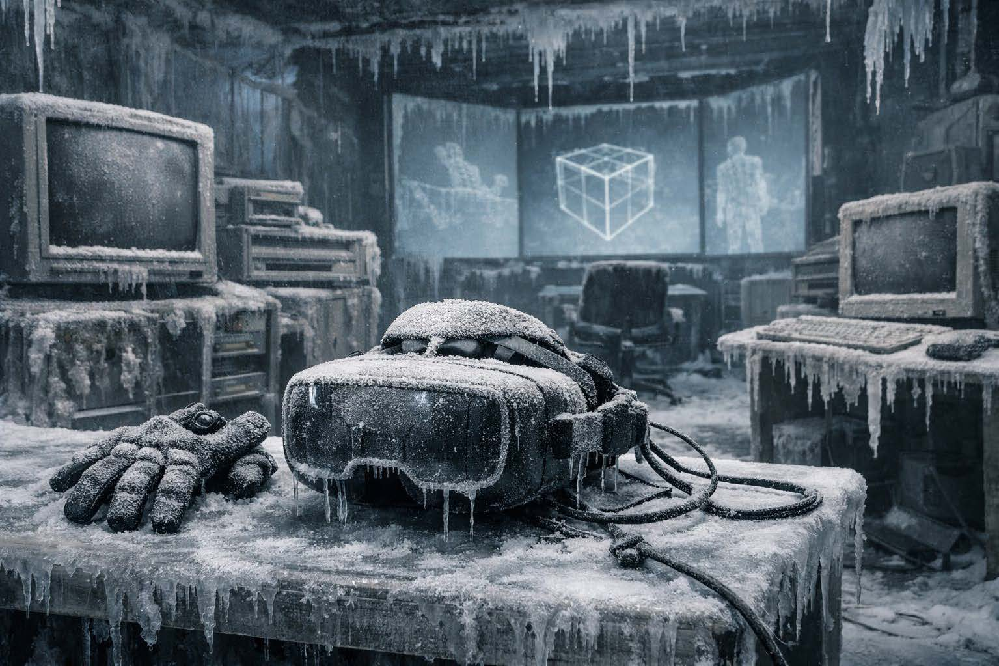

## Ende 1990er Jahre: Die Eiszeit der VR

**Warum scheiterte der erste Hype?**
- Zu geringe Rechenleistung für überzeugende Grafik.
- Niedrige Auflösungen & hohe Latenzen $\rightarrow$ Motion Sickness.
- Unzuverlässiges Tracking.
- Primitive Interaktion.
- **Fazit:** Die Vision war größer als die Technik.
VR überlebte nur in Nischen (Forschung, Autoindustrie).

---
<!-- _class: img-right-->
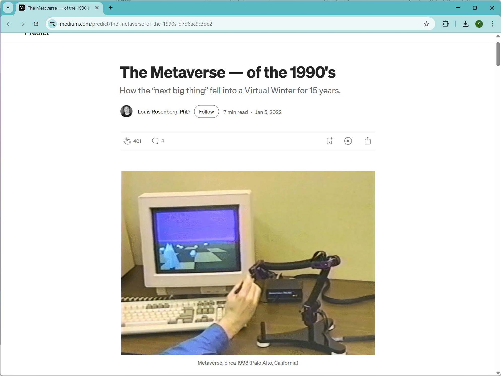

Artikel-Tipp: "The Metaverse - of the 1990's" (Medium)
https://medium.com/predict/the-metaverse-of-the-1990s-d7d6ac9c3de2

---
<!-- _class: img-right-->
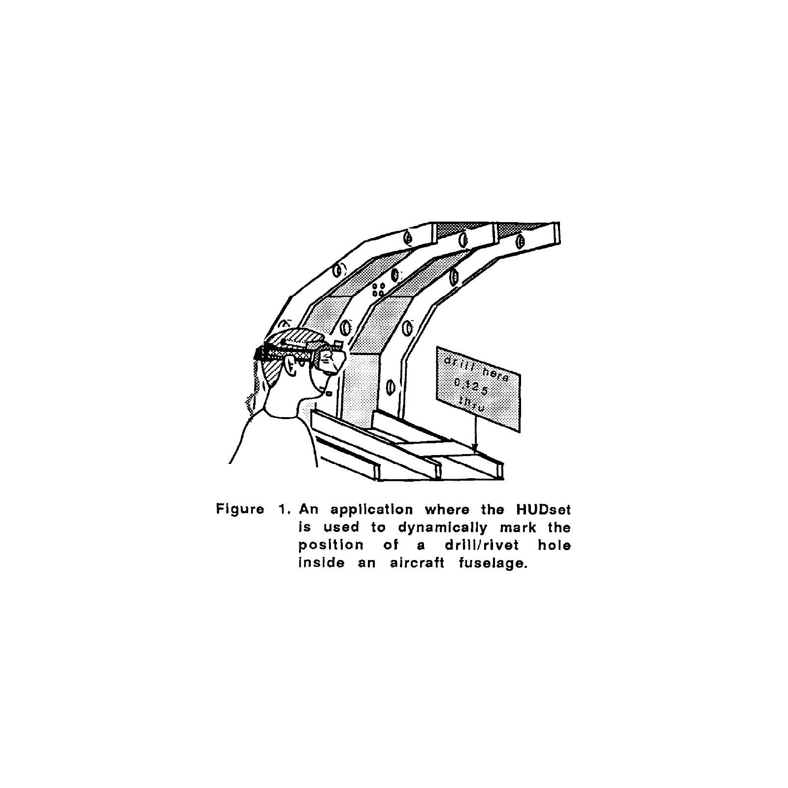

## Frühe 1990er: Augmented Reality (Boeing)

- **1992:** Caudell und Mizell (Boeing) prägen den Begriff „Augmented Reality“.
- **Paper:** „Augmented Reality: An Application of Heads-Up Display Technology to Manual Manufacturing Processes“.
- **Idee:** Ersatz physischer Schablonen durch digitale CAD-Overlays in der Flugzeugfertigung (Kabelbäume, Montage).
- **Hardware:** See-through Head-Mounted Display (HUDset) mit 6-DOF-Tracking.

---
<!-- _class: img-right-->
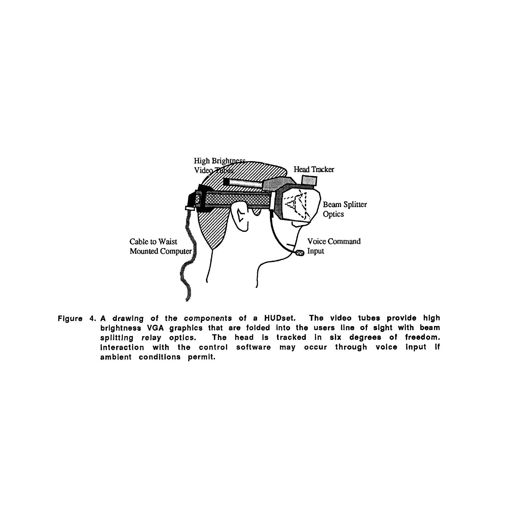

## Boeing HUDset Konzept

- **Komponenten:**
    - Waist-Mounted Computer.
    - High Brightness Video Tubes (VGA).
    - Beam Splitter Optics.
    - Head Tracker.
- **Fokus:** Einfache Grafiken (Wireframes, Text) für Echtzeitfähigkeit auf damaliger Hardware.
- Einführung des Begriffs "Augmented Reality"

---
- **Anwendungen:**
    - Kabelbaum-Formboards
    - Stecker-und Montagearbeiten
    - Composite-Layup
    - Wartung & Demontage komplexer Bauteile
- **Herausforderung: Registrierung und Tracking**

---
<!-- _class: img-right-->
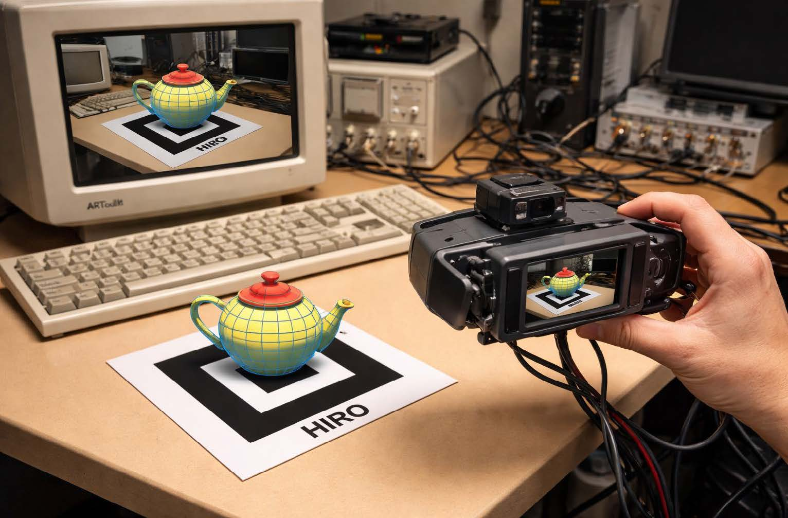

## 1993-1999: Haptik & Mobile AR

Wichtige Entwicklungen in dieser Ära:

1.  **PHANTOM Haptic Interface**
2.  **MARS** (Mobile Augmented Reality Systems)
3.  **ARToolKit**

---
<!-- _class: img-right-->
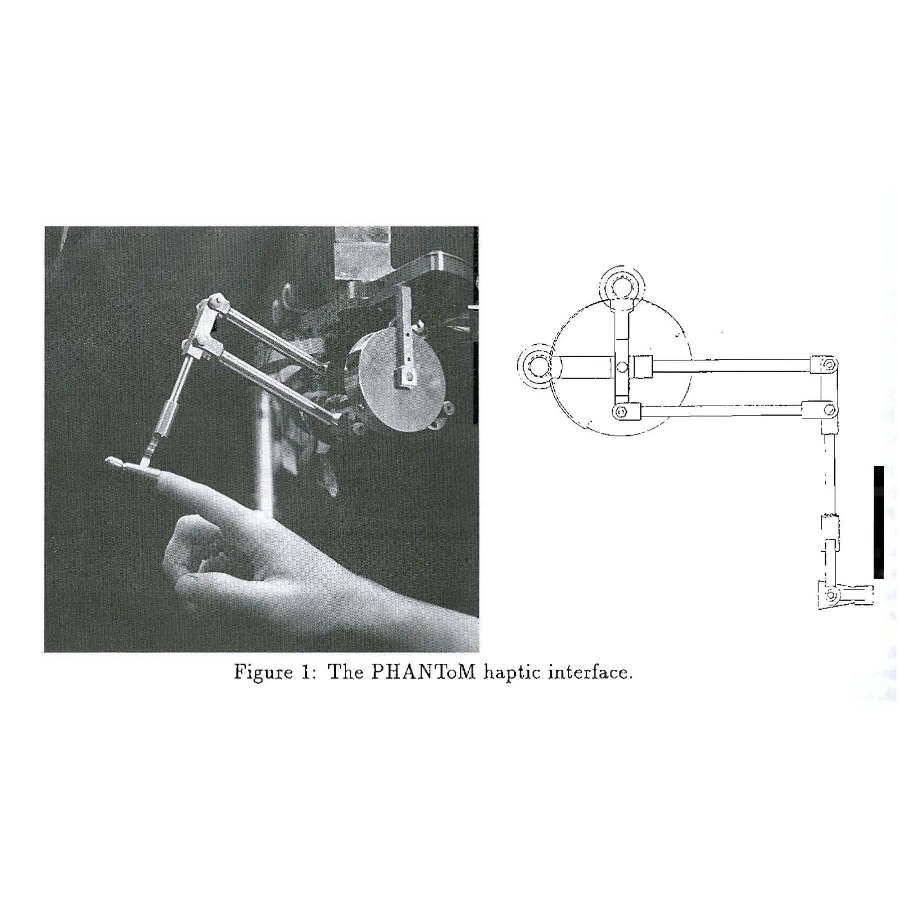

## 1994: The PHANTOM Haptic Interface

- Entwickelt von Massie & Salisbury.
- **Funktion:** Force-Feedback-Gerät (Stift-basiert).
- **Prinzip:** Misst Position der Fingerspitze, gibt gezielte Kräfte zurück.
- **Ziel:** Virtuelle Objekte fühlbar machen (Form, Größe, Masse, Textur).
- 3 Freiheitsgrade (Translation).

---
## 1994: The PHANTOM Haptic Interface

> Nutzer können Form, Größe und Masse virtueller Objekte allein durch Tasten erkennen –selbst ohne visuelle Darstellung

> Meilenstein der Haptik, Grundlage späterer VR-und AR-Systeme mit taktilem Feedback

---
<!-- _class: img-right-->
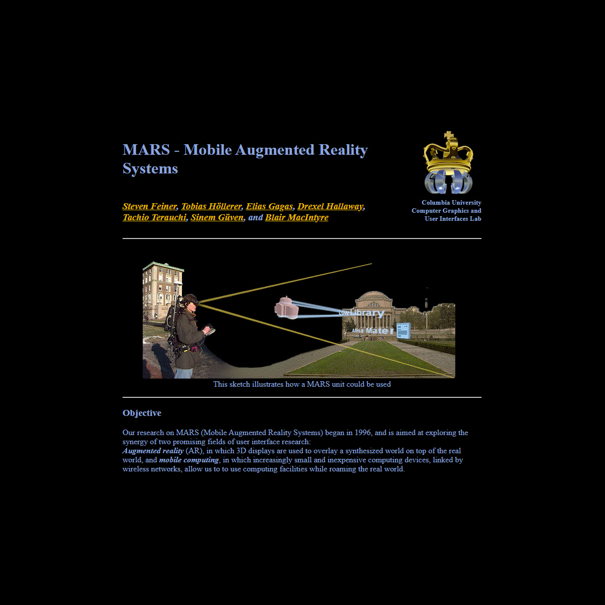

## 1997: MARS (Mobile AR Systems)

- Columbia University (Feiner et al.).
- Erstes System, das AR mit **Wearable Computing** kombiniert (Rucksack-PC).
- **Anwendung:** Campus-Tour (Informationen über Gebäude eingeblendet).
- **Tracking:** Differential GPS (Position) + Magnetometer/Inklinometer (Orientierung).
- **Erkenntnis:** AR ist auch mit ungenauem Tracking nützlich, wenn Inhalte semantisch verankert sind.

###### https://www.cs.columbia.edu/graphics/projects/mars/mars.html

---
<!-- _class: img-right-->

## 1999: ARToolKit

- Entwickelt von Hirokazu Kato (HIT Lab).
- **Durchbruch:** Erstes Open Source AR-SDK (2001).
- **Technik:** Video-basiertes Marker-Tracking (schwarze Quadrate, z.B. "Hiro"-Marker).
- Ermöglichte exakte Überlagerung von 3D-Objekten auf reale Marker.
- Cross-Platform & Basis für viele frühe AR-Apps.
---
# Ab in die Zukunft
<!-- _class: structural -->
> Was ist das nächste große Ding?
Vom Hype zum Standard:
Wie AR / VR / MR die Zukunft der Technolgien beeinflussen.

---
## Um 2000 –Kostensenkung & neue Tracking-Verfahren:Infrarot-Tracking

---
## Ab 2013 –Durchbruch für Konsumenten-VR

---
## Oculus Rift, HTC Vive, PlayStation VR
---
## AR in den 2010er JahrenGoogle Glass

---
## Ab 2017ARKit, ARCore

---

