<!-- _class: titlepage -->
# Vorlesungsreihe: Virtual Reality (VR)
## Fachlehrer  Stefan Sauer
### THWS Geovisualisierung

---
<!-- _class: structural img-right-->
## Technische, sensorische und psycholgische Grundlagen der Virtual Reality
Welche technischen Vorraussetzungen werden für Virtual Reality benötigt und welche unterschiedliche Arten von virtuellen Erfahrungen gibt es?

Wie erreichen wir eine möglichst hohe Akzeptanz unserer Anwendung?

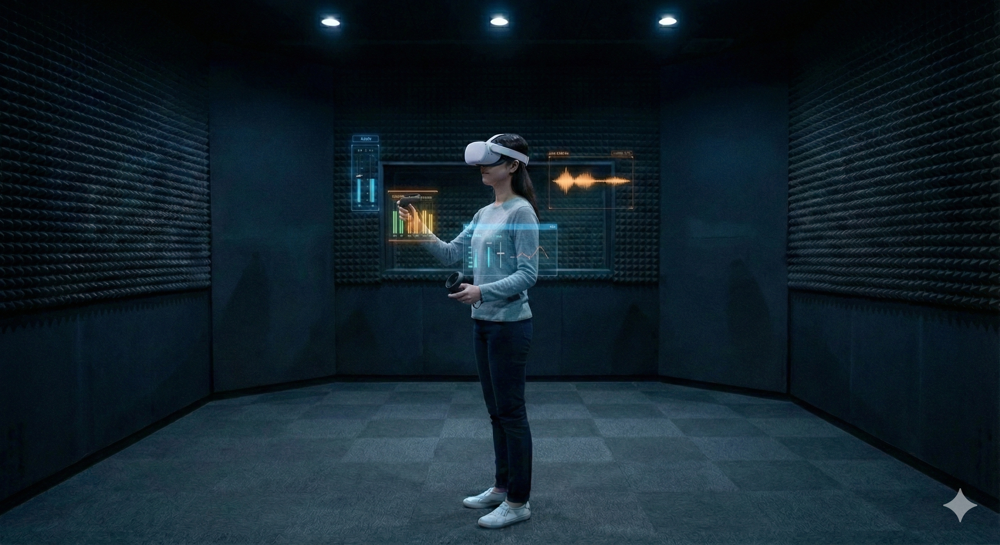

---
# Agenda & Lernziele
1. [Einleitung und Definitionen](#einleitung-und-definitionen)
2. [Die 4 Komponenten nach LaValle](#die-4-Komponenten-nach-LaValle)
3. [Das Reality-Virtuality-Kontinuum](#das-reality-virtuality-kontinuum)
4. [Die I3-Definition nach Burdea](#die-i3-Definition-nach-Burdea)
5. [Biologische Zielplattform: Der Organismus](#biologische-zielplattform-der-organismus)
5. [Das Uncanny Valley: Fast real ist nicht genug](#das-uncanny-valley)
6. [Tracking & Sensorik](#tracking)
---
7. [Optik & HMDs](#optik--hmds-das-fenster-zur-welt)
7. [Interaktionsformen](#interaktionsformen)
8. [Großsysteme & Kollaboration](#großsysteme--kollaboration)
9. [Zukunft der Geovisualisierung](#zukunft-der-geovisualisierung)

---
<!-- _class: structural -->
# Einleitung und Definitionen

[Einleitung und Definitionen](#agenda--lernziele)

---

<!-- _class: structural -->
# Einleitung: VR in der Geovisualisierung
Virtual Reality ist weit mehr als ein technologisches Artefakt der Unterhaltungsindustrie; sie markiert den Übergang von der rein symbolischen Kartographie zur immersiven räumlichen Erfahrung. 

Wir definieren VR als **„Perception Engineering“** – die methodische Konstruktion und Manipulation sensorischer Reize, um das menschliche Gehirn zur Akzeptanz einer alternativen Realität zu bewegen.

Perception = Wahrnehmung

---

# Relevanz für Geovisualisierer
Für Geovisualisierer ist diese Disziplin von strategischer Relevanz: Statische 3D-Modelle werden durch immersive Umgebungen ersetzt, die eine intuitive Exploration komplexer Geodaten ermöglichen. 

Das Verständnis der Schnittstelle zwischen technischer Stimulation und neurobiologischer Reaktion ist das Fundament, auf dem wir die nächste Generation räumlicher Entscheidungsunterstützungssysteme errichten.

---
<!-- _class: fullscreen -->
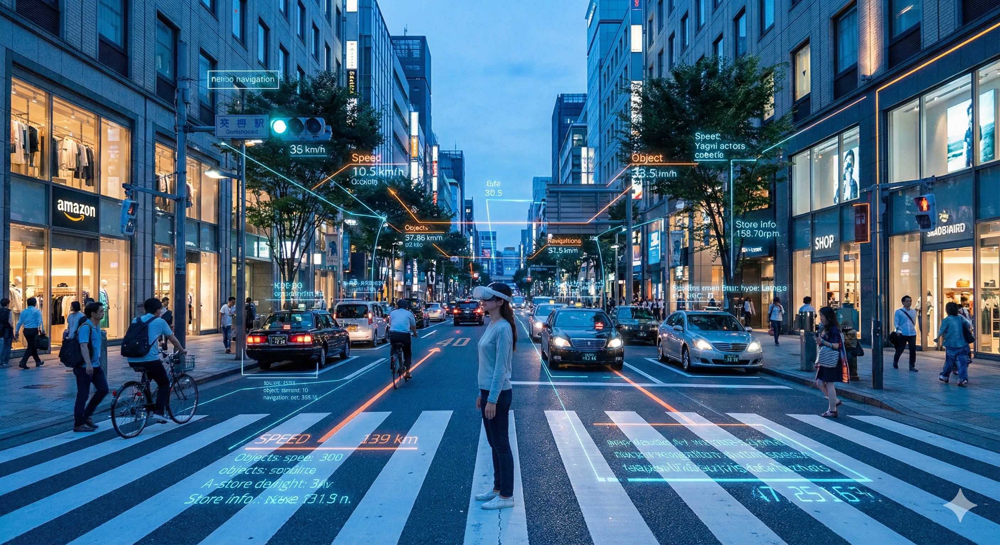

---
<!-- _class: img-right -->

# Begriffserklärung: Immersion
> **Immersion** (dt. Eintauchen) beschreibt den Effekt, bei dem ein Nutzer die physische Realität um sich herum vergisst und eine virtuelle Welt als real wahrnimmt. Es ist das Gefühl, "wirklich dort" zu sein.

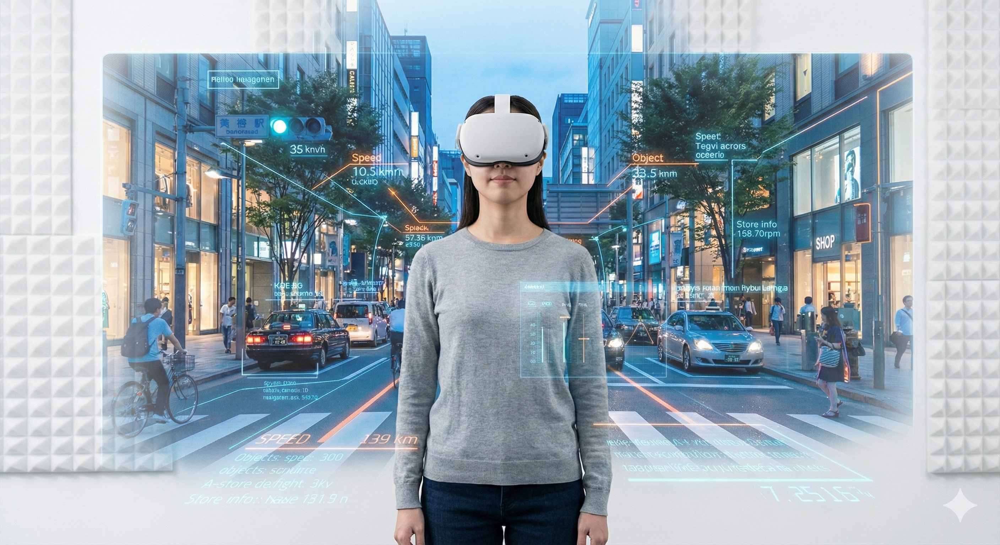

---

# VR: Eine formale Definition
Virtual Reality (VR) ist die Induzierung eines gezielten Verhaltens in einem Organismus durch künstliche sensorische Stimulation, während der Organismus kaum oder gar kein Bewusstsein für den Eingriff hat [LaValle, 2019].

- VR ist keine Frage spezifischer Hardware (wie HMDs), sondern ein fundamentales Konzept der Wahrnehmungssteuerung.
- Das Ziel ist die Aufrechterhaltung einer konsistenten Wahrnehmungsillusion.

---
<!-- _class: img-right -->

# Begriffserklärung: HMD
> **HMD** steht für "Head-Mounted Display". Das ist der Fachbegriff für die VR-Brille, die man sich auf den Kopf setzt, um das Display direkt vor den Augen zu haben.

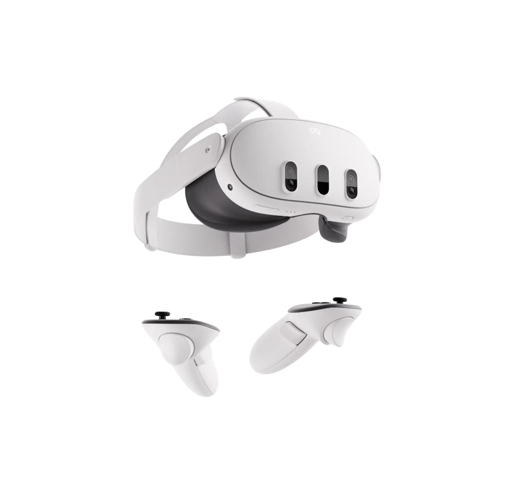

---
<!-- _class: structural -->
# Die 4 Komponenten nach LaValle
1. Zielgerichtetes Verhalten (Targeted Behavior)
2. Organismus (Organism)
3. Künstliche sensorische Stimulation (Artificial Sensory Stimulation)
4. Bewusstsein (Awareness)

---
<!-- _class: fullscreen -->
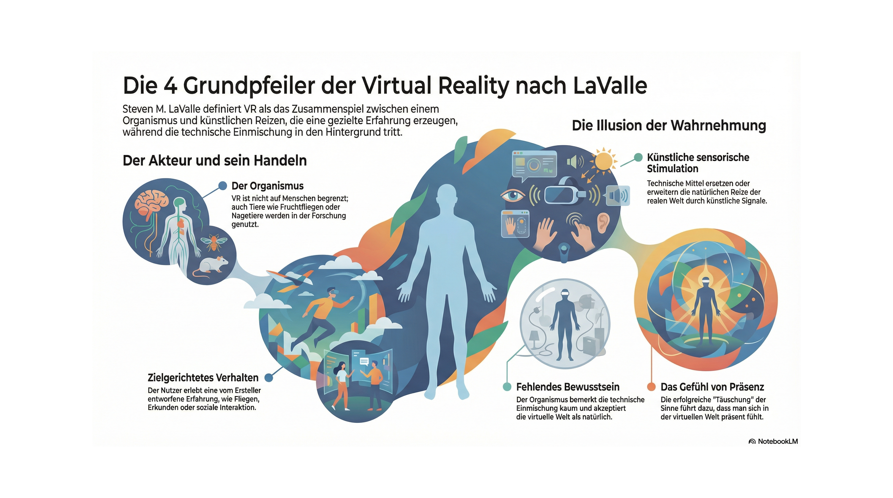

---

# Die erste Komponente: Gezieltes Verhalten
Die erste Komponente der Definition ist das **Targeted Behavior**. Das Verhalten des Nutzers wird durch den Schöpfer der VR-Erfahrung entworfen [LaValle, 2019].

In der Geovisualisierung umfasst dies:
- Das Durchwandern eines geplanten Stadtviertels.
- Die Inspektion unterirdischer Infrastrukturen.
- Die Interaktion mit multidimensionalen Geodatenströmen.

---
<!-- _class: img-right -->

# Die zweite Komponente: Der Organismus
VR adressiert biologische Systeme, primär den Menschen [LaValle, 2019].

In der Forschung wird VR auch bei Mäusen (virtuelle Labyrinthe) oder Primaten eingesetzt, um neurobiologische Prozesse der räumlichen Orientierung zu untersuchen [LaValle, 2019].

Für uns bedeutet dies: Wir müssen die physiologischen Parameter des menschlichen Nutzers als feste Randbedingungen unseres Designs akzeptieren.

###### <a href="[#](https://www.n-tv.de/mediathek/videos/panorama/Neurologen-setzen-Maus-Mini-VR-Brille-auf-article25490763.html)">VR bei Mäusen</a>

---

<video src="img/VR-goggles-for-mice-let-researchers-study-their-brains_REUTERS.mp4" controls></video>

###### VR bei Mäusen

---

# Die dritte Komponente: Künstliche Stimulation
Die natürlichen Sinne werden durch Ingenieursleistung kooptiert [LaValle, 2019].

- Die Stimulation ersetzt oder ergänzt gewohnte Reize durch digitale Signale.
- **Geovis-Bezug:** Wir ersetzen das Licht der realen Umgebung durch Lichtmuster eines Displays, die eine geografische Realität simulieren.

---

# Die vierte Komponente: Bewusstsein und Presence
Der Erfolg eines VR-Systems bemisst sich daran, ob der Organismus die "Täuschung" als natürlich akzeptiert [LaValle, 2019].

Dies führt zum Gefühl der **Presence** – das Gefühl, physisch in der virtuellen Welt zu sein, trotz des Wissens um die Künstlichkeit.

---
<!-- _class: img-right -->

# Neurobiologie der Presence
Neurobiologisch manifestiert sich Presence in der Aktivierung von „Place Cells“ und „Grid Cells“.

- **Place Cells:** Nervenzellen im Gehirn, die feuern, wenn wir an einem bestimmten Ort sind.
- **Grid Cells:** Zellen, die wie ein internes Koordinatensystem funktionieren.
- Diese kodieren räumliche Informationen, selbst wenn der Raum virtuell ist [LaValle, 2019].

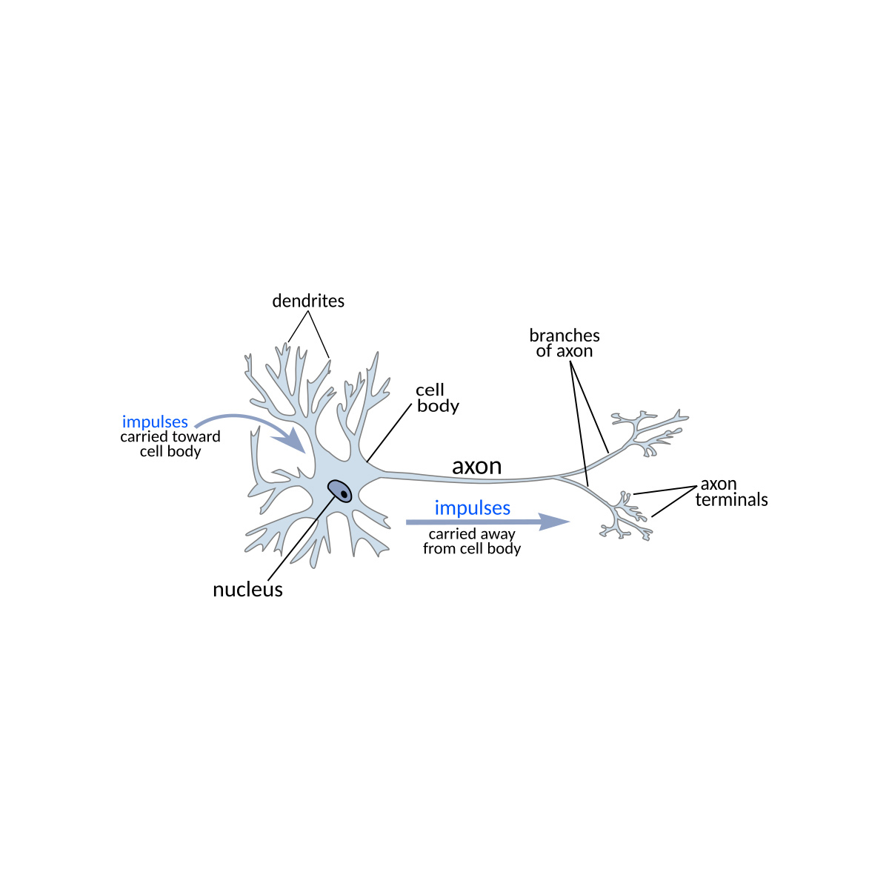
###### LaValle Figure 2.18

---

# Quick Check: Interaktion
**Frage an die Runde:**
Warum ist LaValles Definition so breit gefasst, dass sie nicht einmal Hardware wie Bildschirme erwähnt?

---
<!-- _class: structural -->

# Das Reality-Virtuality-Kontinuum

---
<!-- _class: img-right -->

# RV-Kontinuum nach Milgram und Kishino
Nach Milgram und Kishino (1994) existiert eine Skala zwischen der physischen Realität und der rein virtuellen Umgebung [Mulders et al., 2020].

Das Kontinuum wird oft als Pfeil dargestellt, auf dem sich verschiedene Technologien einordnen lassen. Dieses Modell hilft uns zu entscheiden, wie viel Realitätsbezug für eine spezifische Visualisierungsaufgabe notwendig ist.

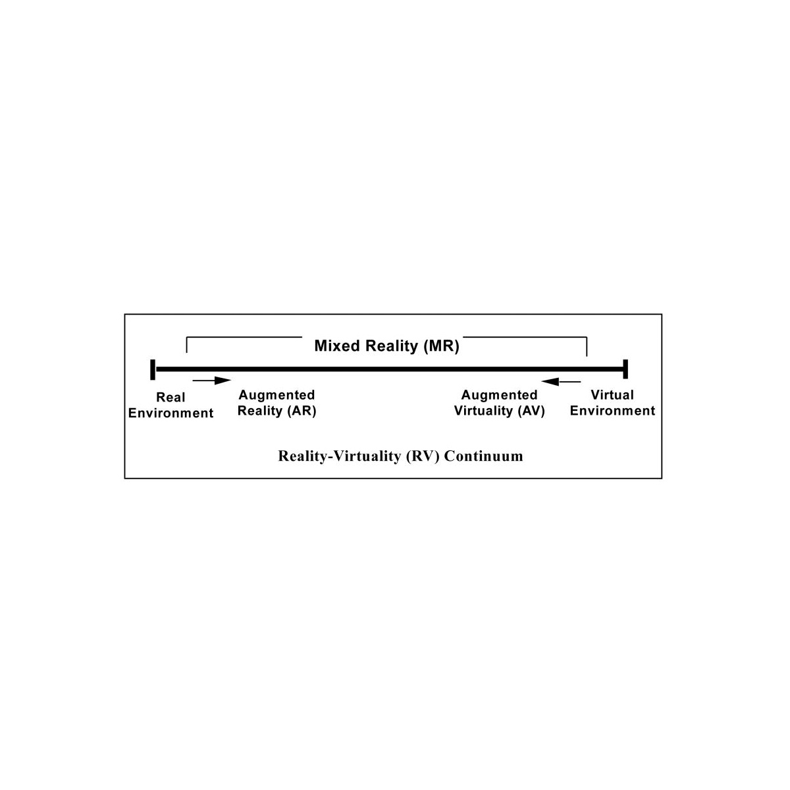
###### Moulders-Fig1-reality-virtuality-continuum
---

# Real Environment und AR
**Real Environment:** Die physische Welt ohne digitale Überlagerung.

**Augmented Reality (AR):** Einblendung digitaler Strukturen (z.B. 3D-Stadtmöbel) in die direkt wahrgenommene reale Welt [Mulders et al., 2020]. 
Der Nutzer bleibt in der realen Welt verankert, was für die Vor-Ort-Planung essenziell ist.

---

# Augmented Virtuality (AV)
Hier wird eine primär virtuelle Umgebung durch reale Objekte oder Videostreams ergänzt [Mulders et al., 2020].

**Beispiel:** Ein Planer steht in einem virtuellen Modell eines Gebäudes, sieht aber seine eigenen realen Hände durch einen Kameraschnitt. Dies erhöht das Vertrauen in die eigene Handlungsfähigkeit im virtuellen Raum.

---

# Mixed Reality (MR) und Virtual Reality (VR)
**Mixed Reality (MR):** Der Sammelbegriff für das gesamte Spektrum zwischen Realität und Virtualität [Mulders et al., 2020].

**Virtual Reality (VR):** Die vollständige Loslösung von der physischen Umgebung zugunsten einer computergestützten Simulation [Mulders et al., 2020]. Für Geovisualisierer bedeutet VR maximale Kontrolle über Licht, Skalierung und Zeit.

---

# Begriffserklärung: Kontinuum
> Ein **Kontinuum** ist eine lückenlose Abfolge. In unserem Fall bedeutet es, dass die Grenzen zwischen der echten Welt (Realität) und der künstlichen Welt (Virtualität) fließend sind.

---

# Strategische Evaluation: Wann nutzen wir VR?
VR ist ideal, wenn die reale Welt unzugänglich, zu gefährlich oder noch nicht existent ist (z.B. Simulation von Meeresspiegelanstiegen).

**So What?** Die Wahl der Position auf dem Kontinuum bestimmt den Rechenaufwand und die Hardwareanforderungen. Je virtueller die Erfahrung, desto kritischer wird die physiologische Akzeptanz (Latenz, Tracking-Präzision) [LaValle, 2019].

---

# Einfluss auf die Visualisierungsstrategie
- **VR:** Fokus auf vollständige Immersion und emotionale Wirkung von Architektur.
- **AR:** Fokus auf Kontextualisierung und präzise Überlagerung von Katasterdaten in der Landschaft.

Die Strategie muss sich nach der notwendigen kognitiven Verbindung zur realen Umgebung richten [Mulders et al., 2020].

---
<!-- _class: img-right-->

# Übergang von 3D-Modellen zur Immersion
Klassische 3D-Modellierung am Monitor ist "Window-on-the-World" (niedrige Immersion).

VR transformiert diese Modelle in bewohnbare Räume. Dies verändert die Art der Datenexploration von der passiven Betrachtung zur aktiven, räumlichen Erfahrung [Mulders et al., 2020].

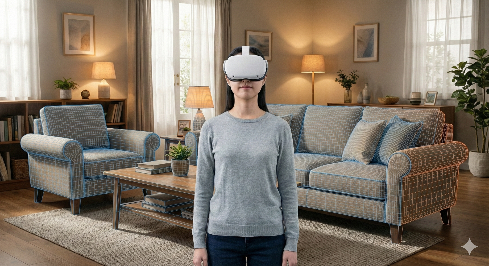

---
<!-- _class: structural-->

# Die I3-Definition nach Burdea
Virtual Reality wird durch die drei Säulen des "VR-Dreiecks" charakterisiert [Mulders et al., 2020]:

1. **Immersion:** Das Eintauchen in die künstliche Welt.
2. **Interaction:** Die Echtzeit-Reaktion des Systems auf Nutzeraktionen.
3. **Imagination:** Die mentale Fähigkeit, das Modell als Realität zu internalisieren.

---
<!-- _class: fullscreen -->
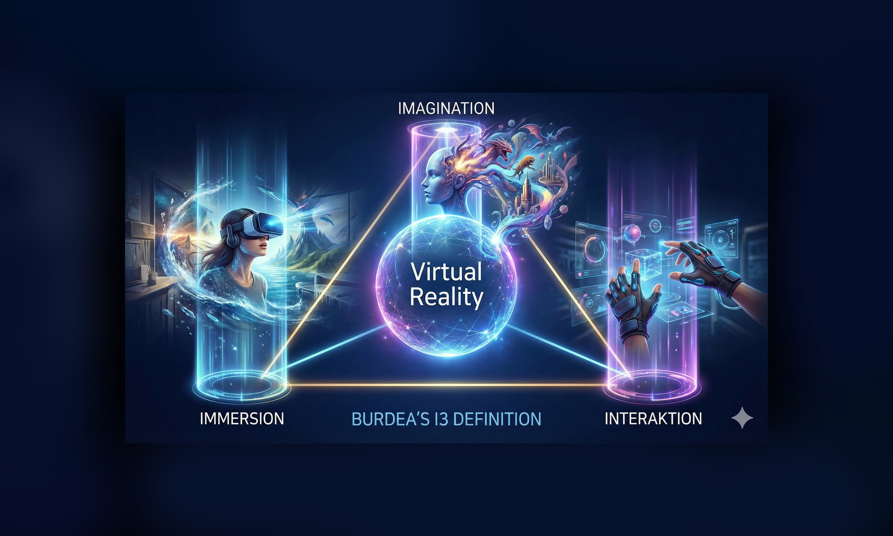

---

# Physische Immersion
Erreicht durch technische Parameter (HMD, binaurales Audio, Haptik), die auf die Bewegungen des Nutzers reagieren [Mulders et al., 2020].

Die Technik bildet eine sensorische Hülle um den Nutzer. In der Geovisualisierung ist die visuelle Komponente (Sichtfeld, Auflösung) meist die dominanteste Form der physischen Immersion.

---

# Mentale Immersion
Beschreibt den Zustand tiefer psychologischer Einbindung ("Being deeply engaged") [Mulders et al., 2020].

Dies kann auch durch einfache Grafik erreicht werden, wenn die Interaktionslogik und das Storytelling konsistent sind. Für Geovisualisierer ist es entscheidend, dass die Datenqualität die mentale Immersion stützt, statt sie durch Fehler zu brechen.

---

# Interaction: Die Brücke zum Nutzer
Interaktivität bedeutet, dass das System Eingaben (Gesten, Kopfbewegungen) registriert und verzögerungsfrei antwortet [Mulders et al., 2020].

Ohne Interaktion bleibt VR ein 360-Grad-Film; erst durch Interaktion wird sie zu einer explorativen Umgebung. Dies ist der Schlüssel für partizipative Planungsprozesse in der Stadtentwicklung.

---

# Imagination: Die Rolle des Nutzers
Imagination ist die Fähigkeit des Gehirns, nicht-existente Dinge wahrzunehmen und mentale Modelle zu bilden [Mulders et al., 2020].

VR aktiviert kognitive Werkzeuge, die dem Nutzer helfen, abstrakte Konzepte (z.B. elektromagnetische Felder in einer Stadt) zu visualisieren. Ein Übermaß an Reizen kann die Imagination jedoch ersticken.

---

# "Perception Engineering" als neue Disziplin
Wir betreiben Reverse Engineering des menschlichen Körpers, um Wahrnehmungsillusionen zu liefern [LaValle, 2019]. Dies verbindet Informatik, Ingenieurwesen und Psychologie.

**In der Geovisualisierung bedeutet dies:** Wir designen nicht nur Karten, sondern das Erleben von Raum.

---
# Bineurales Audio
**Zielsetzung**
Die Simulation des räumlichen Hörens (Richtungshören) über Kopfhörer, um eine realistische akustische Umgebung zu schaffen. Ohne räumliches Audio entsteht eine "virtuelle Schwerhörigkeit", die das Situationsbewusstsein einschränkt.

---

# Begriffserklärung: Binaurales Audio
> **Binaurales Audio** ist eine Aufnahmetechnik, die es ermöglicht, Töne so wahrzunehmen, als kämen sie aus einer bestimmten Richtung im Raum (links, rechts, hinten, oben). Es imitiert das menschliche Hören.

---

**Kernaspekte**
-   **Immersion & Präsenz:** Binaurales Audio ist essenziell, um das Gefühl zu erzeugen, tatsächlich an einem Ort zu sein (Präsenz).
-   **Selektive Aufmerksamkeit:** Ermöglicht den "Cocktail-Party-Effekt", d.h. die Fähigkeit, sich auf eine bestimmte Schallquelle in einer lauten Umgebung zu konzentrieren.
-   **Cross-modale Interaktion:** Akustische Hinweise lenken den visuellen Fokus und beschleunigen die Reaktionszeit auf visuelle Ziele.

---
<!-- _class: img-right-->
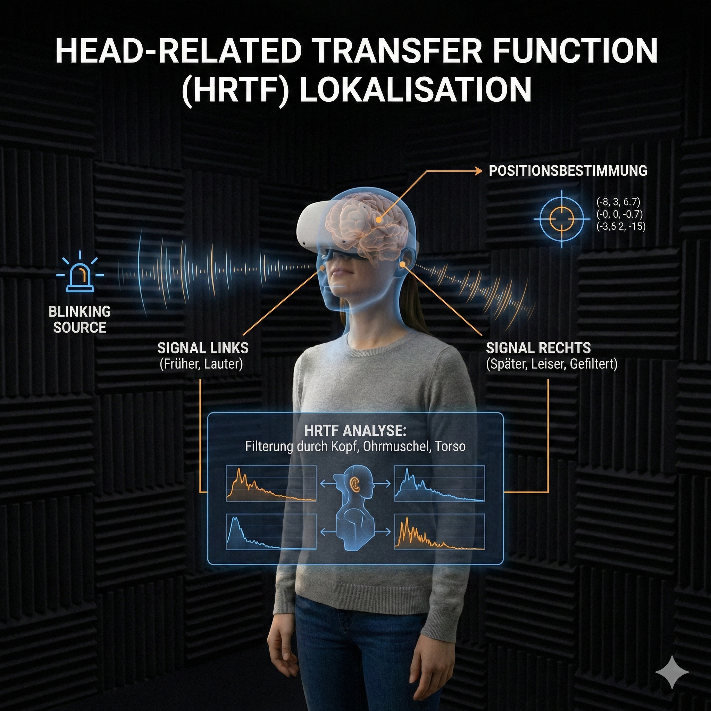

# Psychoakustische Grundlagen (HRTF)

Das Gehirn berechnet die Position einer Schallquelle aus der Analyse der Signale beider Ohren, zusammengefasst in der **Head-Related Transfer Function (HRTF)**.

---

**Die drei Hauptindikatoren:**
1.  **ITD (Interaural Time Difference):** Zeitdifferenz zwischen den Ohren. Dominant bei tiefen Frequenzen (< 2 kHz).
2.  **ILD (Interaural Level Difference):** Pegelunterschied durch den akustischen Kopfschatten. Dominant bei hohen Frequenzen (> 2 kHz).
3.  **Spektrale Cues:** Filterwirkung der Ohrmuschel (Pinna). Notwendig zur Bestimmung der Elevation (oben/unten) und zur Auflösung der Vorne-Hinten-Verwirrung.

---
<!-- _class: img-right-->

*Ohne spektrale Cues entsteht der "Kegel der Verwirrung" (Cone of Confusion), in dem Positionen mehrdeutig sind .*

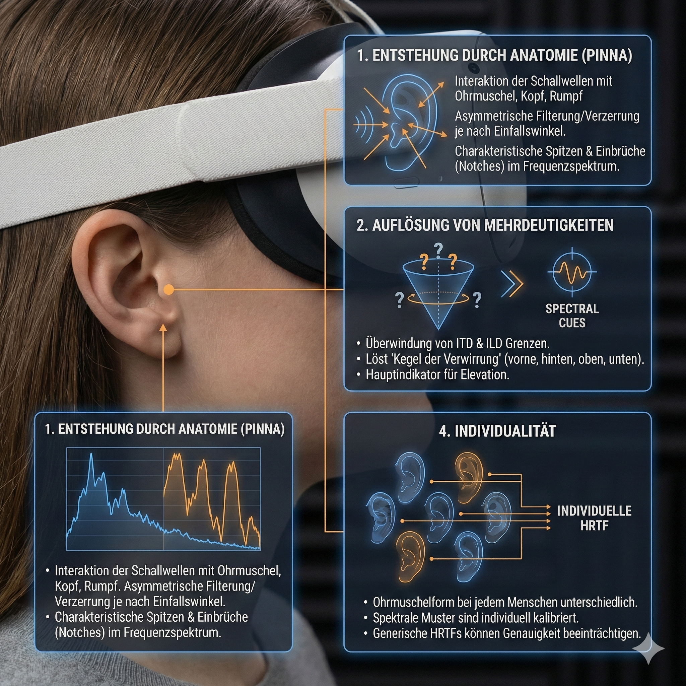
---

<!-- _class: fullscreen -->
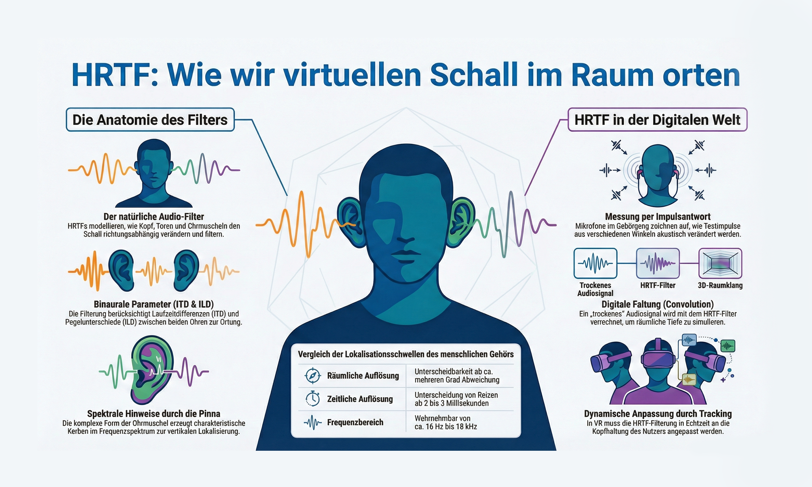

---

# Technische Umsetzung & Herausforderungen

**Realisierung**

-   **HRTF-Filterung:** Um eine virtuelle Schallquelle zu platzieren, wird das Audiosignal mit der HRTF gefaltet, die der gewünschten Position entspricht.
-   **Head-Tracking:** Essenziell für die Externalisierung (Wahrnehmung außerhalb des Kopfes). Kopfbewegungen helfen dem Gehirn, den "Kegel der Verwirrung" aufzulösen und die Position zu fixieren.

---

**Herausforderungen**
-   **Individualisierung:** Standard-HRTFs passen nicht zu jeder Ohrmuschelform, was zu Lokalisierungsfehlern (z.B. Vorne-Hinten-Vertauschung) führen kann.
-   **Raumakustik:** Für eine glaubhafte Distanzwahrnehmung müssen auch Nachhall und Reflexionen simuliert werden.
-   **Rechenlast:** Die Echtzeit-Faltung (Convolution) mehrerer Quellen erfordert hohe Rechenleistung.

---

# Diskussionsfragen
- Wo endet die klassische Kartographie und wo beginnt VR?
- Warum akustischen Faktoren sind ein Hindernis für die Presence?
- Kann ein Roman als VR-System betrachtet werden? Begründen Sie mit LaValle.

---

# Mögliche Prüfungsfragen
1. Nennen und erläutern Sie die 4 Komponenten der VR-Definition nach LaValle.
2. Skizzieren Sie das RV-Kontinuum und ordnen Sie AR, AV und VR ein.
3. Unterscheiden Sie mentale von physischer Immersion nach Mulders et al.
4. Welche Rolle spielt Binaurales Audio in der VR?

---
<!-- _class: structural-->

# Biologische Zielplattform: Der Organismus
Der Erfolg von Perception Engineering hängt fundamental davon ab, wie gut wir die biologische Zielplattform verstehen: Den menschlichen Organismus.

---
<!-- _class: img-right -->

# Warum Biologie verstehen?
Um VR-Systeme gesundheitsschonend zu gestalten, müssen wir das visuelle und vestibuläre System verstehen.

Design ohne Rücksicht auf die menschliche Physiologie führt unweigerlich zu **VR-Sickness** und Abbruch der Immersion. Wir betrachten den Körper als ein System, das durch "Reverse Engineering" entschlüsselt werden muss [LaValle, 2019].

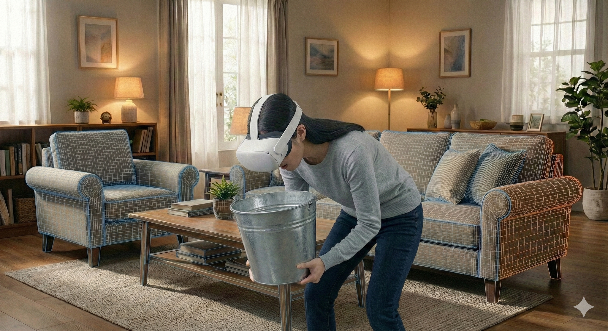

---
<!-- _class: img-right -->

# Der Lichtweg im Auge
Licht tritt durch die **Cornea** (Hornhaut) ein, wird durch die Linse fokussiert und trifft auf die **Retina**.

In VR müssen Displays die **Akkommodation** (Fokussierung der Linse) künstlich stimulieren, was oft zu Konflikten führt (Vergence-Accommodation Conflict).

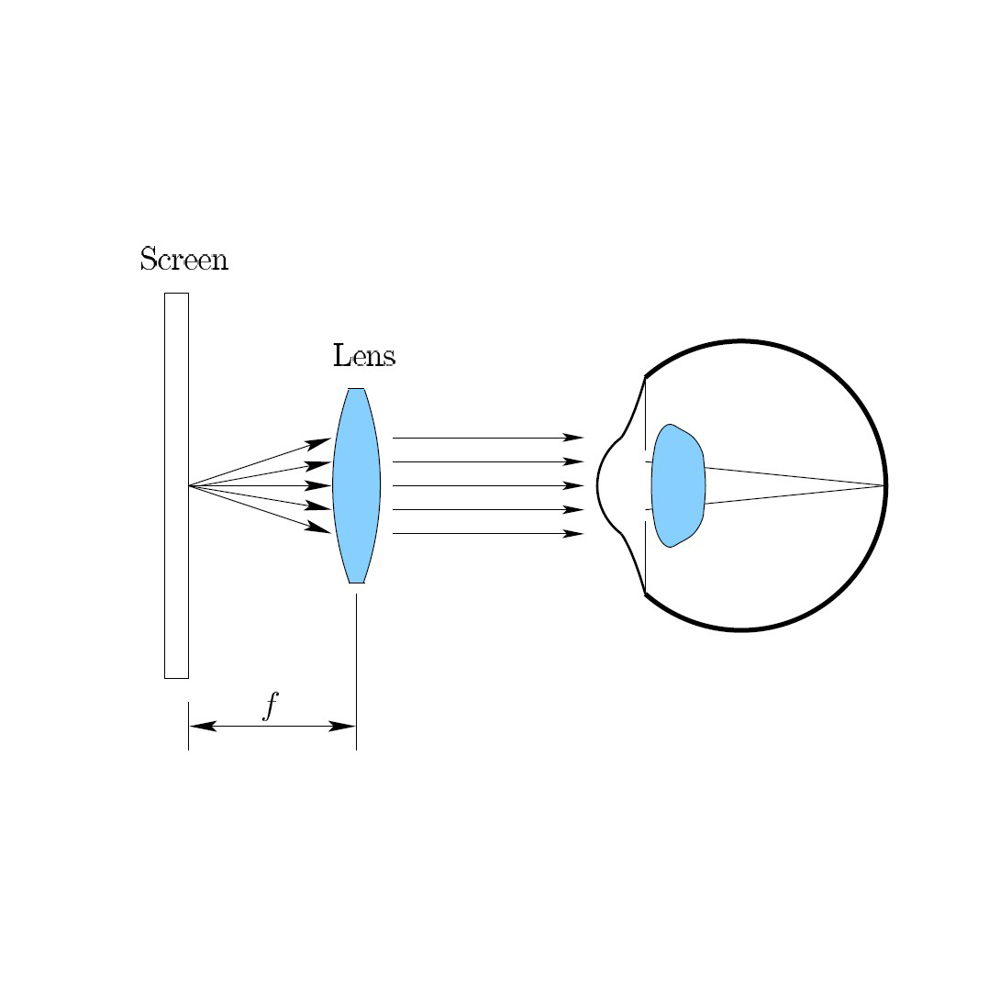
##### LaValle-Figure-4.30

---
<!-- _class: img-right -->

# Begriffserklärung: Retina & Cornea
> **Cornea:** Die klare, vordere Schicht des Auges (Hornhaut).
> **Retina:** Die Netzhaut im Hintergrund des Auges, die das Licht in elektrische Signale für das Gehirn umwandelt.

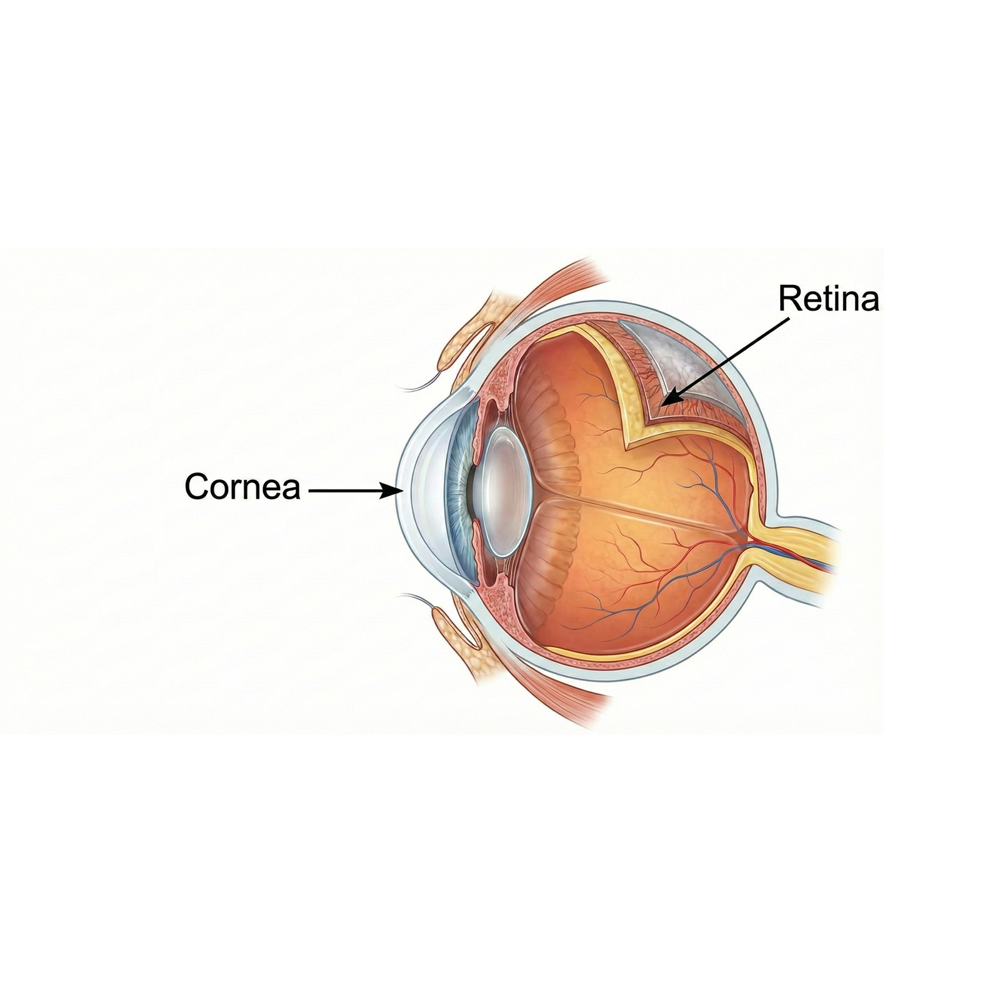

---

# Der Prozess der visuellen Wahrnehmung
Licht wird in neuronale Impulse umgewandelt und über den Sehnerv an den visuellen Cortex geleitet [LaValle, 2019].

VR-Systeme müssen Bilder mit einer Frequenz liefern, die über der **Flimmerfusionsfrequenz** liegt, um eine kontinuierliche Bewegung zu suggerieren. In der Geovisualisierung ist die Erhaltung der visuellen Kontinuität kritisch.

---

# Begriffserklärung: Flimmerfusionsfrequenz
> Die **Flimmerfusionsfrequenz** ist die Rate (Bilder pro Sekunde), ab der das menschliche Auge aufeinanderfolgende Bilder nicht mehr als einzelne Blitze, sondern als flüssiges Bild wahrnimmt.

---

# Tiefenwahrnehmung in VR
VR nutzt primär stereoskopisches Sehen (binokulare Disparität), um räumliche Tiefe zu erzeugen [LaValle, 2019].

Zusätzlich müssen monokulare Tiefenhinweise wie Texturgradienten, Verdeckung und atmosphärische Perspektive korrekt implementiert werden. Fehler führen zu Orientierungslosigkeit.

---
<!-- _class: img-right -->

# Farbwahrnehmung und Realismus
Das menschliche Auge interpretiert Wellenlängen; VR-Displays mischen RGB-Werte (Rot, Grün, Blau), um dieses Spektrum zu imitieren.

In der Geovisualisierung ist die Farbtreue für die Interpretation von thematischen Karten (z.B. Hitzeinseln) im 3D-Raum entscheidend. Unnatürliche Farbsättigungen können die kognitive Belastung erhöhen [LaValle, 2019].

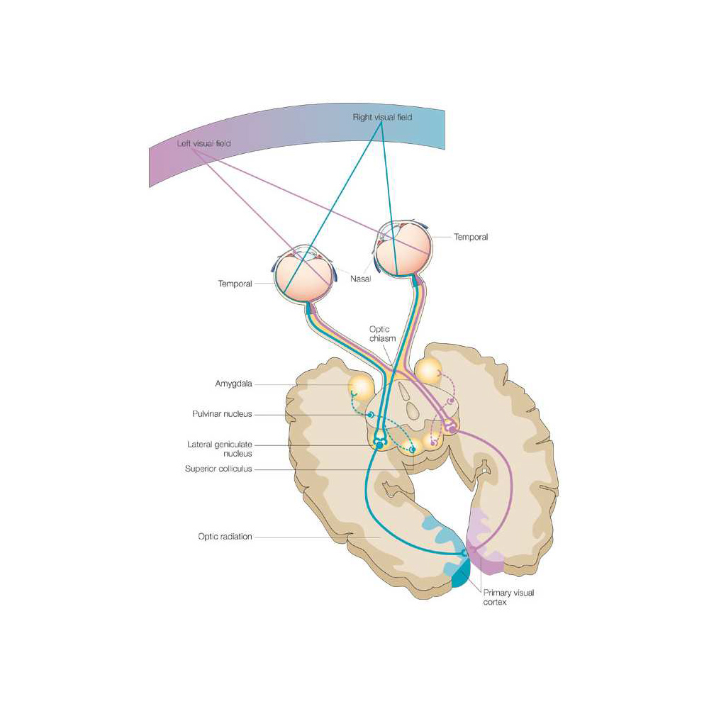
###### LaValle-Figure-5.12

---
<!-- _class: structural img-right -->
# Augenbewegungen und Optimierung
**Sakkaden** (schnelle Sprünge) und glatte Blickfolgebewegungen sind für die Exploration von Umgebungen essenziell [LaValle, 2019].

Modernes **Foveated Rendering** nutzt das Wissen über die geringe Sehschärfe in der Peripherie, um Rechenleistung zu sparen.
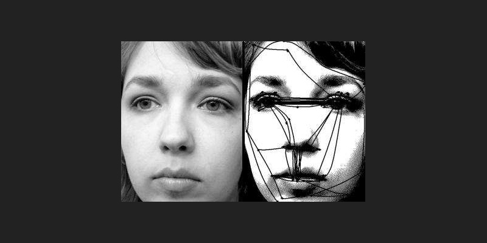
###### Saccaden nach LaValle-Figure-5.15

---
<!-- _class: fullscreen -->

##### The fractal appears to be moving until you carefully fixate on a single part to verify that it is not.
###### LaValle-Figure-5.12

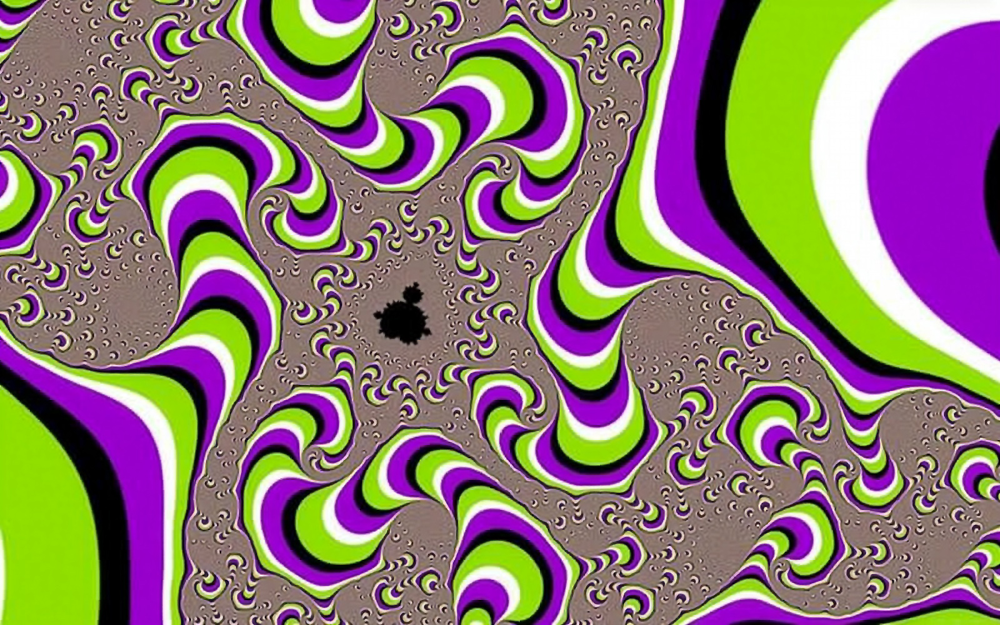

---

# Begriffserklärung: Foveated Rendering
> Eine Technik, bei der das Bild nur dort extrem scharf berechnet wird, wo man gerade hinsieht. Der Randbereich wird unschärfer berechnet, was viel Rechenpower spart, ohne dass man es merkt.

---
<!-- _class: fullscreen -->
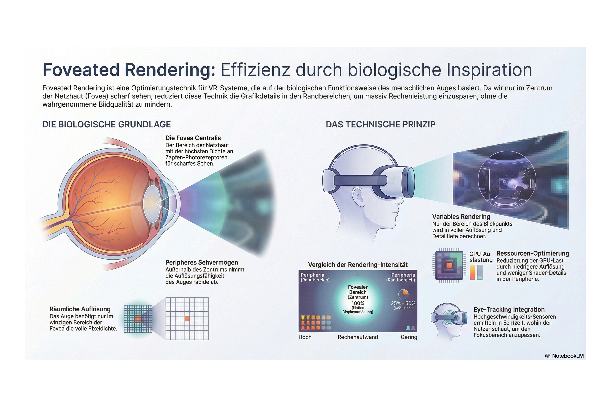

---
**Biologischer Hintergrund**
-   Wie **Steven LaValle** beschreibt, ist die Dichte der Photorezeptoren im menschlichen Auge in der **Fovea** (dem Zentrum des scharfen Sehens) am höchsten und nimmt zur Peripherie hin stark ab.
-   Herkömmliche Displays rendern jedoch ineffizienterweise überall mit gleichbleibend hoher Pixeldichte.

---

**Das technische Konzept**
-   **Foveated Rendering** simuliert laut **LaValle** die Arbeitsweise des Auges technisch.
-   Die Grafikqualität (Auflösung) wird dynamisch an den Blickpunkt angepasst:
    -   **Zentrum:** Maximale Qualität.
    -   **Peripherie:** Reduzierte Qualität.

---

# Wozu ist es nützlich? (Nutzen & Vorteile)

**Reduktion der Rechenlast**
-   Das Hauptziel ist nach **LaValle** die massive Senkung der **Rechenanforderungen** (Computational Burden) an das Grafiksystem.
-   Da die Fovea nur einen kleinen Teil des Sichtfelds ausmacht, müssen viel weniger Pixel aufwendig berechnet werden.

**Effizienzsteigerung**
-   GPU-Ressourcen werden dort gebündelt, wo sie wahrgenommen werden.
-   Dies ist laut **LaValle** entscheidend, um bei extrem hohen Auflösungen die notwendigen Bildraten (fps) zu erreichen.

---

# Voraussetzungen & Herausforderungen

**Technologie: Eye-Tracking**
-   Das System muss in Echtzeit wissen, wohin die Pupille gerichtet ist. Ein präzises **Eye-Tracking** ist laut **LaValle** zwingende Voraussetzung.

**Technische Hürden**
-   **Latenz:** Die Verzögerung zwischen Augenbewegung und Display-Update muss minimal sein.
-   **Wahrnehmung:** Wenn das Tracking laut **LaValle** zu langsam ist, sieht der Nutzer unscharfe Bereiche, bevor das Bild scharf gestellt wird, was die Immersion stört.

---

# Implikationen für das Design
Räumliche Wahrnehmung in VR ist nicht identisch mit der Wahrnehmung am Desktop. **Maßstabsabhängige Wahrnehmung** muss im Design berücksichtigt werden.

**So What?** Die visuelle Hierarchie wird durch die physische Nähe und Blickrichtung bestimmt, nicht durch das Layout einer 2D-Karte.

---
<!-- _class: structural img-right -->

# Das vestibuläre System: Der Gleichgewichtssinn
Das Innenohr registriert Beschleunigungen und die Orientierung des Kopfes im Raum [LaValle, 2019]. Es fungiert als biologisches Inertialsystem (IMU).

Störungen dieses Systems in VR führen zu schwerwiegenden physiologischen Reaktionen.

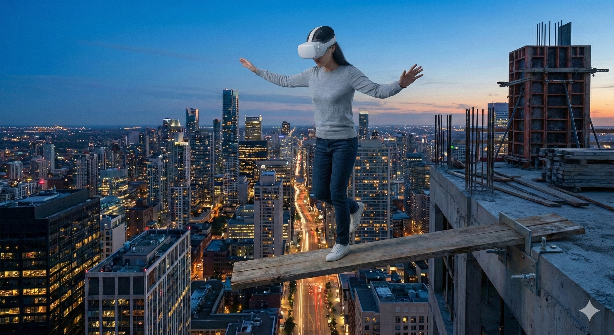

---

# Ursachen von VR-Sickness (Vection)
VR-Sickness entsteht meist durch "Mismatched Motion": Das Auge sieht Bewegung, aber das vestibuläre System meldet Stillstand [LaValle, 2019].

**Vection** ist die illusorische Eigenbewegung; wenn diese inkonsistent ist, interpretiert das Gehirn dies oft als Vergiftungserscheinung (Übelkeit).

---
<!-- _class: img-right -->

# Gesundheitsschutz durch restriktive Gestaltung
VR-Nutzende müssen Bewegung im virtuellen Raum restriktiv gestalten.

**Teleportation** ist oft sicherer als fließende Navigation, da sie keine vestibulären Konflikte provoziert [LaValle, 2019]. Statische Referenzrahmen (z.B. ein virtuelles Cockpit) helfen dem Gehirn.

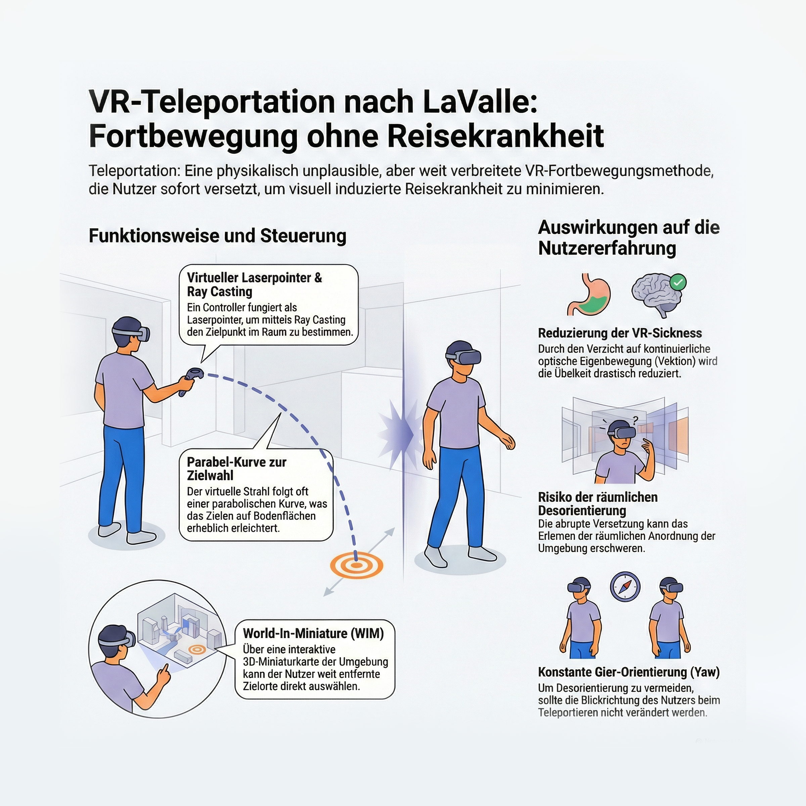

---

# Strategische Bewegungskontrolle
- Vermeidung von Kamera-Wackeln oder abrupten Stopps.
- **So What?** Ein gesundheitlich belastender Entwurf wird von Entscheidungsträgern sofort abgelehnt.
- Die Gesundheit des Nutzers ist eine harte technische Anforderung.

---

# Biologische Akzeptanzgrenzen
Die Latenz (**Motion-to-Photon**) muss unter 20ms liegen, um Übelkeit zu vermeiden [LaValle, 2019].

Die Bildwiederholrate sollte konstant sein; Einbrüche der Framerate bei komplexen Stadtmodellen sind das Hauptrisiko für VR-Sickness.

---
<!-- _class: img-right-->
# Begriffserklärung: Motion-to-Photon Latenz
> Die Zeitverzögerung von dem Moment, in dem du deinen Kopf bewegst, bis zu dem Moment, in dem die Pixel auf dem Bildschirm der Brille reagieren. Ist dieser Wert zu hoch, wird einem schlecht.
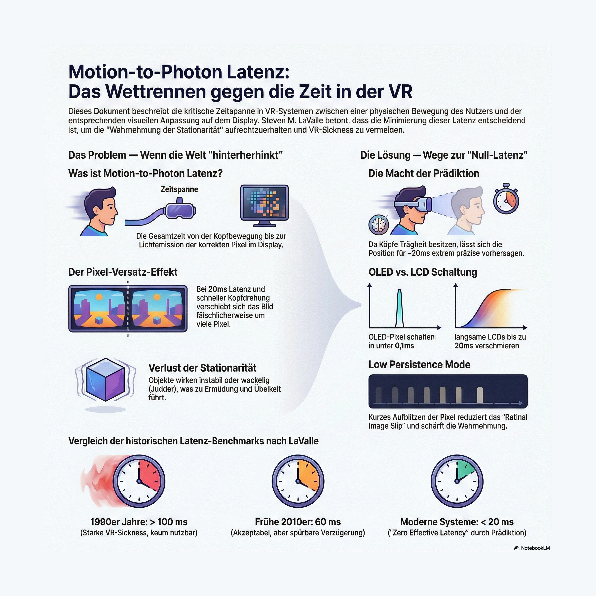

---

# Cognitive Load Theory (CLT) in VR
Das Arbeitsgedächtnis hat eine begrenzte Kapazität für die Informationsverarbeitung [Mulders et al., 2020].

In VR konkurriert die Bedienung des Systems oft mit der Aufnahme der eigentlichen Fachinhalte (z.B. Geodaten). Wir müssen die kognitive Last steuern.

---

# Arten der Belastung in VR
- **Extraneous processing:** Belastung durch schlechtes Design (z.B. verwirrende Menüs) [Mulders et al., 2020].
- **Essential processing:** Die notwendige geistige Anstrengung für das Fachproblem.
- In immersiven Räumen ist die Gefahr der Ablenkung (**Distraction**) besonders hoch.

---

# Begriffserklärung: CTML-Prinzipien
> Die Cognitive Theory of Multimedia Learning (CTML) ist ein theoretischer Rahmen, der beschreibt, wie Menschen mithilfe von instruktionalen (Lehr)Medien lernen. Sie wurde maßgeblich von Richard E. Mayer geprägt und definiert „Multimedia-Lernen“ als die kombinierte Präsentation von Wörtern  und Bildern.

---
<!-- _class: tiny-text -->

**Nach Mulders et al. basiert die CTML auf drei zentralen Annahmen über die menschliche Informationsverarbeitung:**

1. Zwei-Kanal-Annahme (Dual Coding):
Menschen verarbeiten Informationen über zwei getrennte Kanäle – einen für verbale/auditive Informationen und einen für visuelle/bildliche Informationen.
2. Begrenzte Kapazität (Limited Capacity): Die Kapazität jedes Kanals zur Informationsverarbeitung im Arbeitsgedächtnis ist limitiert (basierend auf der Cognitive Load Theory). Instruktionsdesign muss daher unnötige Belastungen (Extraneous Cognitive Load) vermeiden,.
3. Aktive Verarbeitung (Active Processing): Lernen wird als eine generative Aktivität verstanden. Erfolgreiches Lernen erfordert, dass der Lernende aktiv relevante Informationen auswählt (selecting), diese in eine kohärente Struktur organisiert (organizing) und mit bereits vorhandenem Vorwissen integriert (integrating),.

---
> Das Ziel der CTML ist es, durch entsprechende Gestaltung von Lernumgebungen bedeutungsvolles Lernen (meaningful learning) zu ermöglichen, das über reines Auswendiglernen (rote learning) hinausgeht und den Transfer von Wissen zur Problemlösung fördert

---
# CTML-Prinzipien für Visualisierer
- **Signaling Principle:** Wichtige Objekte hervorheben (z.B. Leuchten).
- **Spatial Contiguity:** Beschriftungen direkt am Objekt platzieren.
- **Modality Principle:** Komplexe Räume eher durch Audio erklären als durch viel Text [Mulders et al., 2020].
---

# Scaffolding und Segmenting Principle
Komplexe Aufgaben in kleine Einheiten unterteilen [Mulders et al., 2020].

Führungen (**Guided Tours**) durch das Modell reduzieren die Belastung für Novizen. Informationen sollten "just-in-time" eingeblendet werden.

---
<!-- _class: fullscreen -->
# Begriffserklärung: Scaffolding
## Wörtlich "Gerüstbau". Gemeint ist die Unterstützung von Lernenden durch Hilfestellungen (wie Pfeile oder Erklärungen), die nach und nach abgebaut werden, wenn der Nutzer sicherer wird.

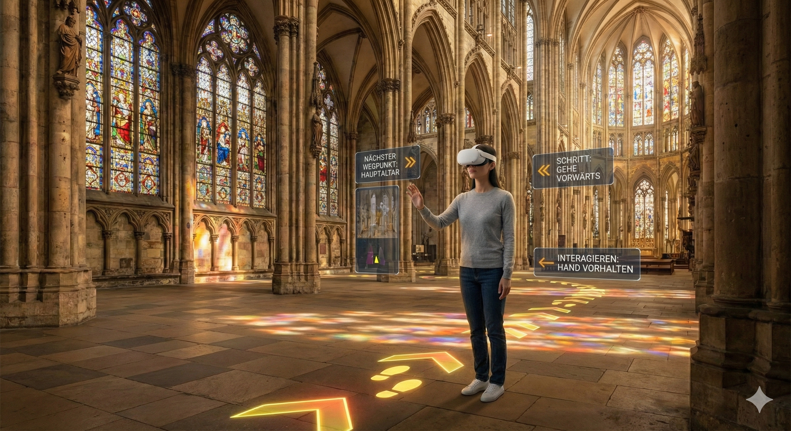

---

# Der Expertise Reversal Effect
Unterstützungsmaßnahmen (wie Pfeile), die Anfängern helfen, können Experten behindern [Mulders et al., 2020].

In Profi-Anwendungen muss das Interface adaptiv sein. Ein Planer benötigt weniger Führung als ein Bürger in einer Partizipationsrunde.

---

# Pretraining außerhalb von VR
Nutzer sollten Grundkonzepte bereits vor dem Aufsetzen des HMDs lernen [Mulders et al., 2020].

Dies hält die Kapazitäten im HMD frei für die räumliche Interaktion. Vorbereitung ist der beste Schutz vor kognitiver Überlastung.

---

# Diskussionsfragen
- Warum ist "Motion-to-Photon Latency" wichtiger als die Grafikauflösung für die Gesundheit?
- Wie viel UI muss sein - wie entscheide ich, welche UI-Elemente notwendig sein und warum Weglassen manchmal besser ist?
- Diskutieren Sie: "Weniger Immersion ist manchmal mehr Lernen" (nach Mulders et al.).

---

# Mögliche Prüfungsfragen
1. Erklären Sie die Ursache von VR-Sickness durch vestibulär-visuelle Konflikte.
2. Nennen Sie drei CTML-Prinzipien und wenden Sie diese auf ein VR-Stadtmodell an.
3. Was versteht man unter dem "Expertise Reversal Effect"?

---
<!-- _class: structural-->
# Das Uncanny Valley
## Psychologische und technische Herausforderungen bei virtuellen Charakteren

---

# Definition und Wahrnehmung

**Das Phänomen nach LaValle (2019)**
-   Steven LaValle beschreibt das *Uncanny Valley* als eine abrupte Akzeptanzlücke.
-   Zunächst steigt die Akzeptanz mit zunehmendem Realismusgrad.
-   Sobald eine Figur jedoch „fast menschlich“ aussieht, aber kleine Unperfektheiten aufweist, fällt die Akzeptanz drastisch ab.

---
**Die Assoziation**
<!-- _class: img-right -->

> LaValle (2019) merkt an, dass Nutzer solche Figuren oft nicht als Menschen, sondern als „Zombies“ oder „sprechende Leichen“ (*talking cadavers*) wahrnehmen, was ein Gefühl des Unbehagens (*uneasy*) auslöst.

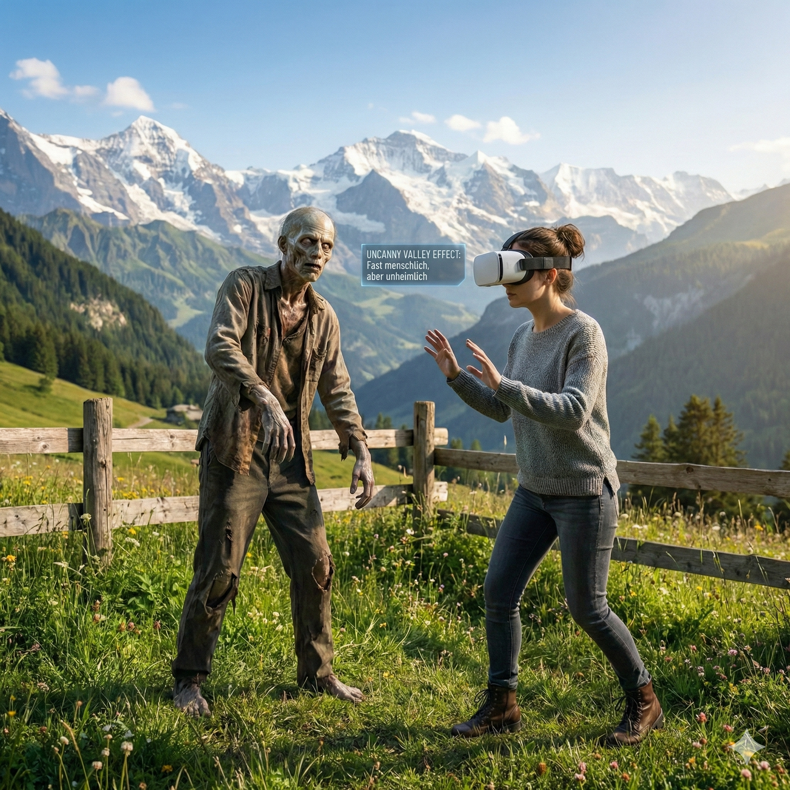

---

# Die Plausibilitätsillusion (Plausibility Illusion)

**Realismus vs. Glaubwürdigkeit nach Dörner et al. (2013)**
-   Dörner et al. betonen, dass für die *Suspension of Disbelief* (das willentliche Ausblenden des Unglaubens) die Glaubwürdigkeit der Ereignisse entscheidender ist als der reine visuelle Fotorealismus.
-   **Der Bruch der Illusion:** Ein visuell perfekter Avatar, der jedoch nur in simplen Phrasen spricht oder dessen Lippen nicht synchron sind, zerstört die Illusion sofort.
---

**Schlussfolgerung**
> Hohe Grafikqualität weckt laut Dörner et al. (2013) eine Erwartungshaltung an das Verhalten, die technisch oft nicht erfüllt werden kann.

---

# Technische Ursachen: Die Animations-Lücke

**Herausforderungen nach Dörner et al. (2013) und Hale & Stanney (2015)**
-   **Komplexität:** Hale & Stanney (2015) weisen darauf hin, dass die Nachbildung subtiler nonverbaler Kommunikation (Mikromimik) extrem rechenaufwendig ist.
---
## Weitere Herausforderungen
-   **Motion Capture Grenzen:** Dörner et al. (2013) erklären, dass aufgezeichnete Bewegungen (*Motion Capture*) zwar realistisch sind, aber schwer an interaktive Situationen (z. B. Blickkontakt halten während der Nutzer sich bewegt) angepasst werden können.
-   **Inverse Kinematik:** Die Echtzeit-Berechnung von Gelenkstellungen wirkt oft roboterhaft und verstärkt den "Uncanny"-Effekt.

---
<!-- _class: fullscreen -->
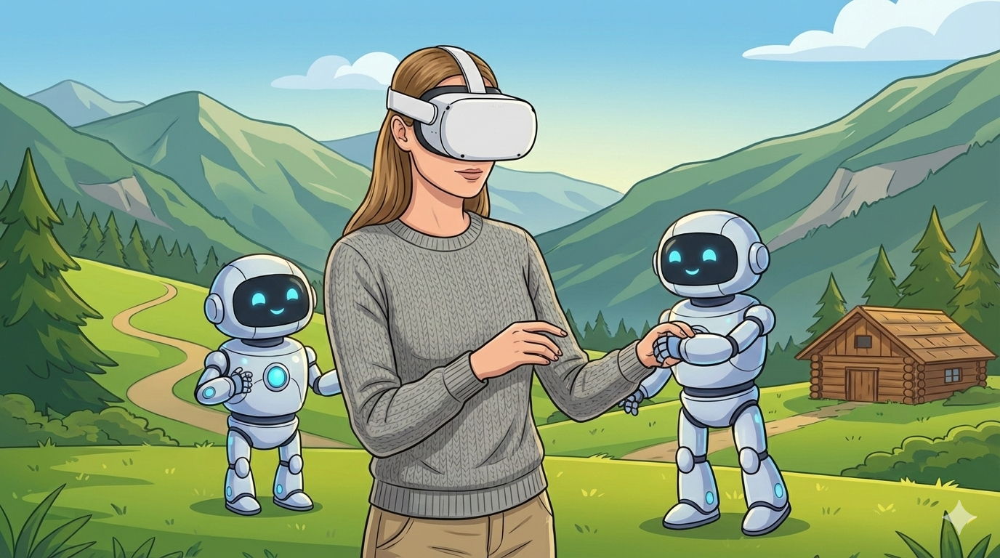

---

# Design-Strategie: Abstraktion

**Empfehlungen nach LaValle (2019)**
-   Um das Uncanny Valley zu umgehen, empfiehlt LaValle (2019) oft den bewussten Verzicht auf den Versuch, die Realität 1:1 zu kopieren (*Universal Simulation Principle*).
-   **Stilisierung:** Cartoon-artige oder abstrahierte Charaktere werden vom Gehirn anders bewertet.
-   Da der Nutzer hier keine menschliche Perfektion erwartet, werden Abweichungen im Verhalten eher verziehen. Die Erfahrung wird dadurch oft konsistenter und angenehmer.

---

# Soziale Interaktion & Avatare

**Bedeutung für Social VR (Hale & Stanney, 2015)**
-   In kollaborativen Umgebungen repräsentieren Avatare den Nutzer.
-   Hale & Stanney (2015) betonen, dass Avatare, die im Uncanny Valley liegen, das Vertrauen und die soziale Bindung in virtuellen Teams stören können.
-   **Best Practice:** Lieber ein einfacher, sympathischer Avatar als ein hochdetaillierter, der "gruselig" wirkt. Die soziale Präsenz hängt stärker von der synchronen Stimme und Gestik ab als von der Texturauflösung der Haut.

---

# Diskussionsfragen

1.  **Erwartungsmanagement (nach Dörner et al.):** Wenn ein visuell perfekter Avatar durch "dummes" Verhalten die Illusion bricht – sollten wir in der Lehre bewusst "Low-Fidelity"-Avatare (einfache) einsetzen, um die kognitive Belastung der Studierenden zu senken?

---
2.  **Design-Entscheidung (nach LaValle):** LaValle argumentiert für Abstraktion. Gibt es dennoch Szenarien (z. B. Forensik, medizinische Diagnostik), in denen wir das Risiko des Uncanny Valley eingehen *müssen*, weil Fotorealismus zwingend erforderlich ist?

---

3.  **Zukunft der Animation:** Können KI-gestützte Animationsverfahren die Lücke zwischen Motion Capture und Echtzeit-Interaktion schließen, die Dörner et al. als Problemfeld beschreiben?

---
<!-- _class: tiny-text -->
# Prüfungsfragen (Schwerpunkt Uncanny Valley)

**Frage 1: Konzeptverständnis**
Erklären Sie das *Uncanny Valley* unter Verwendung der Begrifflichkeiten von **LaValle (2019)**. Warum führt eine Steigerung des Realismus ab einem bestimmten Punkt zu einem drastischen Abfall der Akzeptanz?

**Frage 2: Plausibilität**
Erläutern Sie den Unterschied zwischen *visuellem Realismus* und der *Plausibilitätsillusion* gemäß **Dörner et al. (2013)**. Warum ist letztere für das Präsenzerleben oft wichtiger?

**Frage 3: Lösungsstrategien**
Welche Design-Strategie schlägt **LaValle (2019)** vor, um das Uncanny Valley bei der Entwicklung von VR-Anwendungen kosteneffizient zu vermeiden? Begründen Sie Ihre Antwort.

---
<!-- _class: structural-->
# Tracking
>Definition: 
Tracking ist die kontinuierliche Messung der Position und Orientierung des Nutzers [LaValle, 2019].

Es bildet die Grundlage für die Korrektheit der Perspektive. Ungenaues Tracking zerstört die Presence und führt zu Fehlinterpretationen räumlicher Daten.

---

# 2D- vs. 3D-Tracking
- **2D-Tracking:** Erfassung der Orientierung (Neigung).
- **3D-Tracking:** Erfassung von Position (X, Y, Z) und Orientierung (Yaw, Pitch, Roll) [LaValle, 2019].
- In VR streben wir meist nach **6 Degrees of Freedom (6 DoF)**.

---

<!-- _class: fullscreen -->

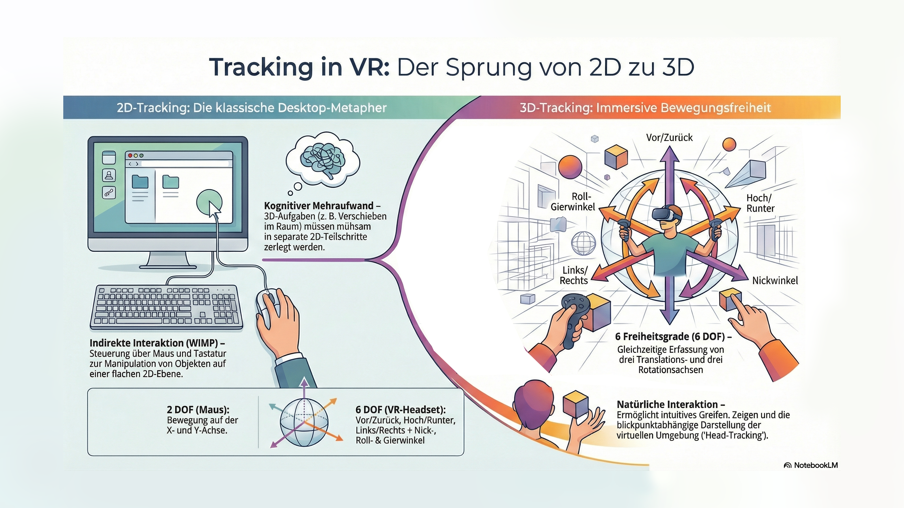

---
<!-- _class: img-right-->
# Begriffserklärung: 6 DoF
> **6 Degrees of Freedom** 6 DOF bedeutet, dass das System sechs Arten von Bewegungen erkennt:
Drehen des Kopfes nach oben/unten, links/rechts, Seite/Seite UND die tatsächliche Bewegung im Raum (vor/zurück, links/rechts, hoch/runter).

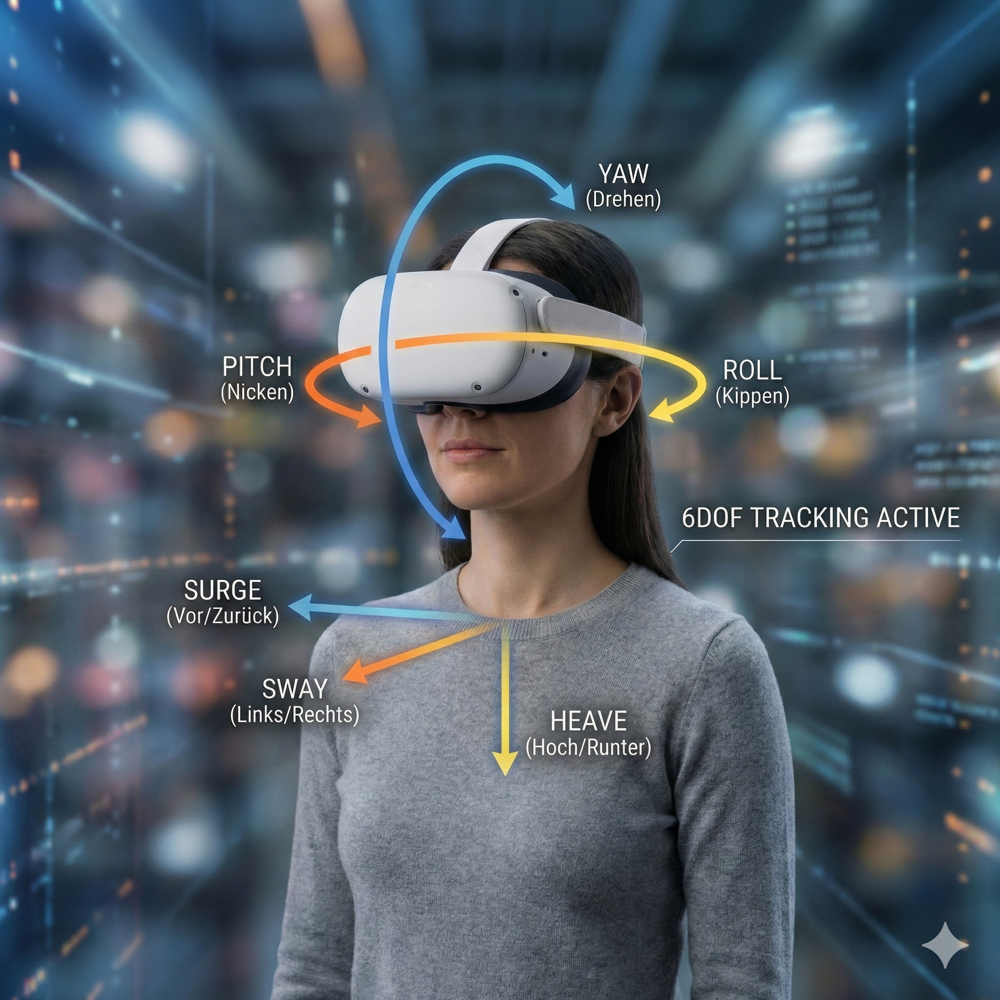

---

# Mathematische Basis: Transformationen
Tracking basiert auf der Änderung von Position und Orientierung relativ zu einem Koordinatensystem.

Hierbei werden **Transformationsmatrizen** genutzt, um Punkte von einem lokalen in ein globales Koordinatensystem zu überführen [LaValle, 2019]. Jede Kopfbewegung löst eine neue "Viewing Transformation" aus.

---

<!-- _class: fullscreen -->

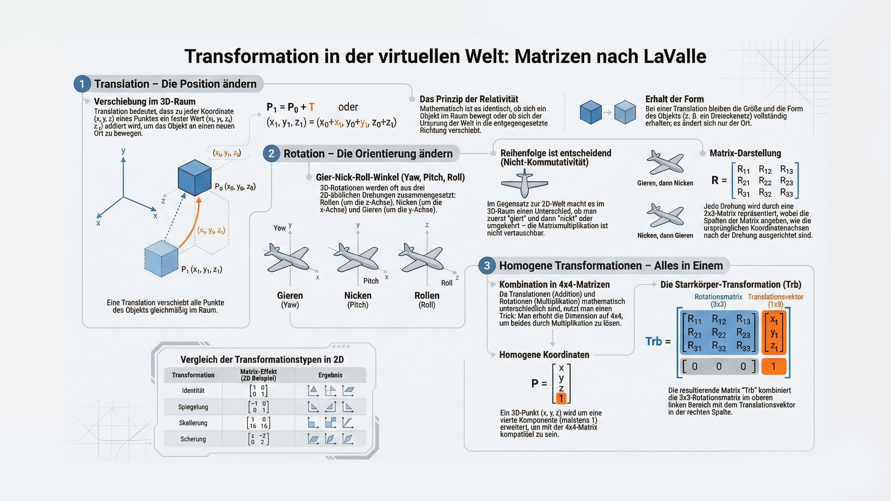

---

# Die Axis-Angle Repräsentation
Um den "Gimbal Lock" zu vermeiden, nutzt VR oft Axis-Angle oder Quaternionen [LaValle, 2019]. Eine Rotation wird durch einen Vektor (Achse) und einen Winkel beschrieben. Dies ist mathematisch stabiler.

---

<video src="img/Euler-Angles-and-Gimbal-Lock-Explained.mp4" controls></video>

###### [By Aerodynamic Animations](https://www.youtube.com/@AerodynamicAnimations)

---
<!-- _class: img-right-->

# Begriffserklärung: Gimbal Lock
> Ein mathematisches Problem bei der Nutzung von Winkeln (X, Y, Z), bei dem zwei Drehachsen aufeinander liegen und man eine Richtung zur Steuerung verliert. Es fühlt sich an wie ein "Einfrieren" der Bewegung.

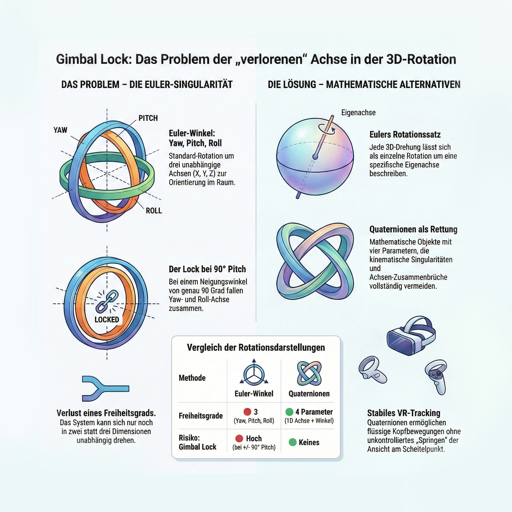

---

# Viewing Transformations in Geovis-Anwendungen
Das System muss die Welt-Koordinaten (z.B. UTM) in Kamera-Koordinaten umrechnen [LaValle, 2019].

Diese Kette von Transformationen muss in Millisekunden erfolgen.
Für Überlagerungen ist Präzision im Sub-Millimeterbereich notwendig.
Game-Engines verwenden häufig keine Welt-Koordinaten, da die Umrechung zu unpräzise ist.
Daher Referenz-Punkt verwenden

---

# Latenz und Jitter
- **Latenz:** Zeitverzögerung zwischen Bewegung und visueller Reaktion.
- **Jitter:** Kleine, hochfrequente Schwankungen im Tracking-Signal, die das Bild "zittern" lassen [LaValle, 2019]. 
- In VR stört Jitter die Lesbarkeit von Beschriftungen massiv.

---

# Drift und Fehlerakkumulation
Sensoren (besonders IMUs) neigen über Zeit zum "Drifting" [LaValle, 2019].

Dies führt dazu, dass der Norden in VR langsam von der realen Nordrichtung abweicht. Korrekturalgorithmen (optische Sensoren) sind zwingend erforderlich.

---
<!-- _class: img-right-->

# Begriffserklärung: IMU
> Eine **Inertial Measurement Unit** ist ein kleiner Sensor (wie im Handy), der Beschleunigung und Drehung misst. Er ist sehr schnell, wird aber mit der Zeit ungenau, wenn er nicht korrigiert wird.

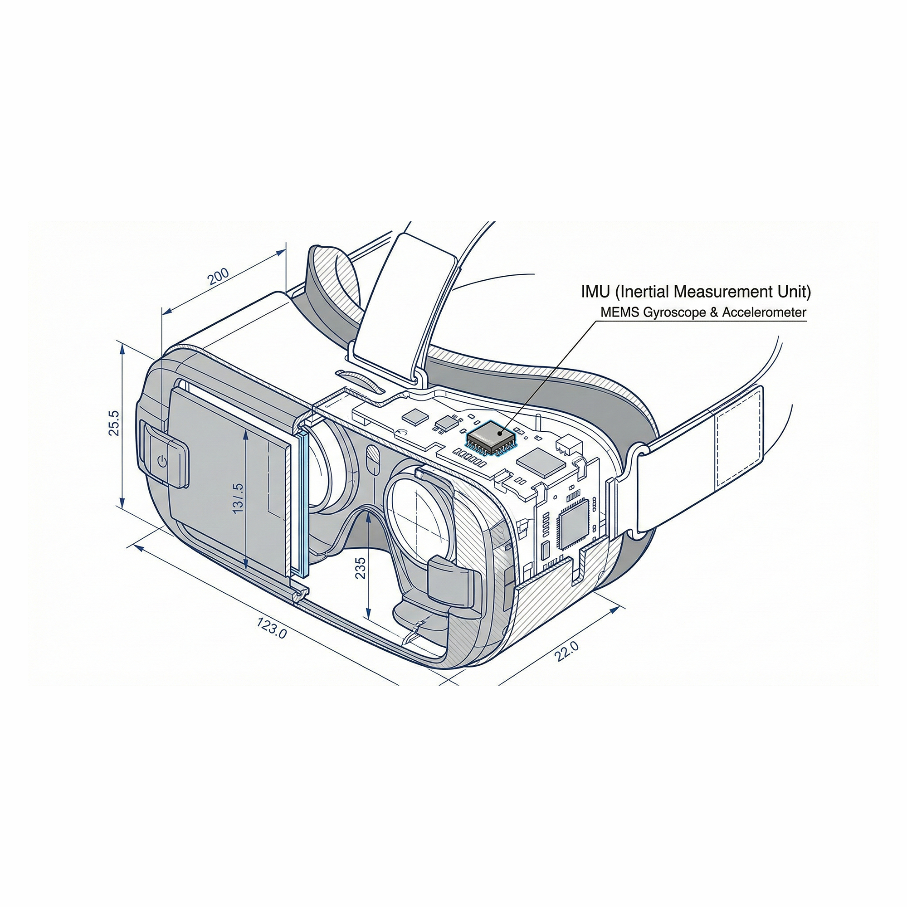

---
<!-- _class: img-right-->

# SLAM: Simultaneous Localization and Mapping
Das System kartiert eine unbekannte Umgebung und bestimmt gleichzeitig die eigene Position darin [LaValle, 2019].

**Geovis-Bezug:** SLAM ermöglicht es, VR/AR-Systeme auf Baustellen einzusetzen, die noch nicht digital erfasst sind.

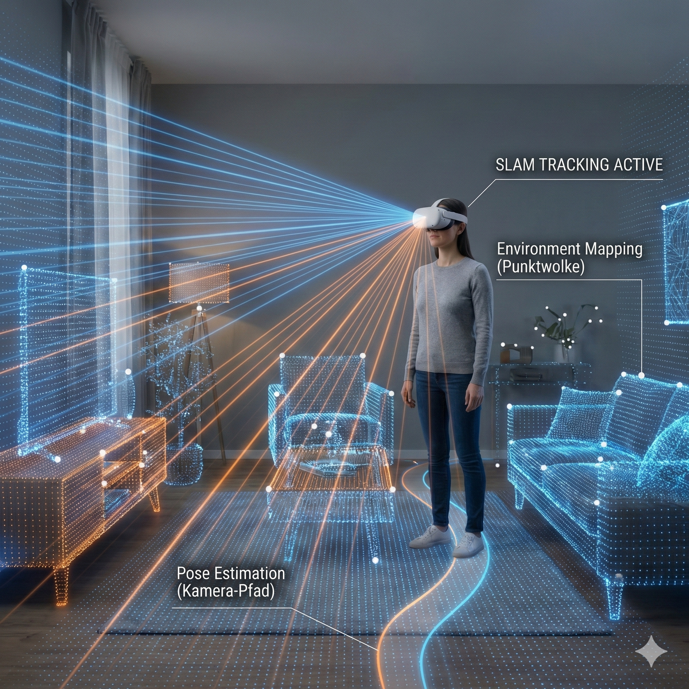

---

# Tiefensensoren und Umgebungserfassung
Einsatz von strukturiertem Licht oder **Time-of-Flight (ToF)** Kameras [LaValle, 2019].

Dies ermöglicht die Kollisionsabfrage zwischen Nutzer und realen Hindernissen (Chaperone-Systeme) und die Erfassung von Ist-Zuständen.

---

# Inside-Out vs. Outside-In Tracking
- **Outside-In:** Externe Kameras beobachten den Nutzer. Höchste Präzision, stationär [LaValle, 2019].
- **Inside-Out:** Kameras im Headset beobachten die Umgebung. Mobil, flexibel, aber anfällig für Lichtverhältnisse.
- **So What?** Bürgerbeteiligung im Park = Inside-Out; Laboranalyse = Outside-In.

---

<!-- _class: fullscreen -->

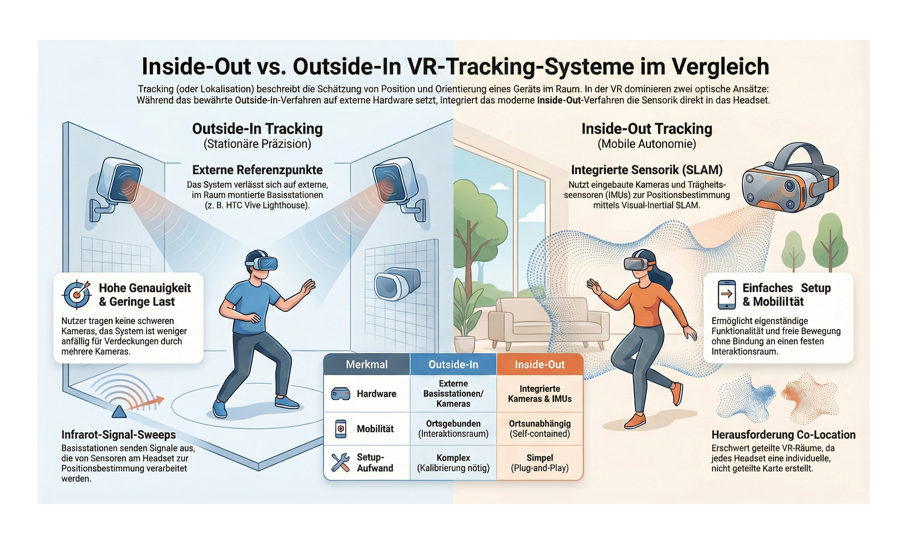

---

# Vergleichstabelle Tracking
| Kriterium | Outside-In | Inside-Out |
| :--- | :--- | :--- |
| Präzision | Sehr hoch (< 1mm) | Hoch (cm-Bereich) |
| Mobilität | Gering (Kabel) | Sehr hoch (kabellos) |
| Setup | Hoch | Minimal |
| Geovis-Eignung | Präzise Modellierung | Vor-Ort Begehung |

---

# Sensor-Fusion: Die Kombination der Daten
Kombination von IMU (schnell) und optischen Sensoren (stabil) [LaValle, 2019]. Ein **Kalman-Filter** schätzt die wahrscheinlichste Position. Dies ist entscheidend für flüssige Bewegung bei komplexen Geo-Szenarien.

---
<!-- _class: img-right-->

# Tracking von Controllern und Händen
- Ermöglicht die Interaktion / Selektion
- Gestensteuerung reduziert Buttons.
- Haptisches Feedback bei Controllern gibt Rückmeldung über Berührung virtueller Objekte [LaValle, 2019].

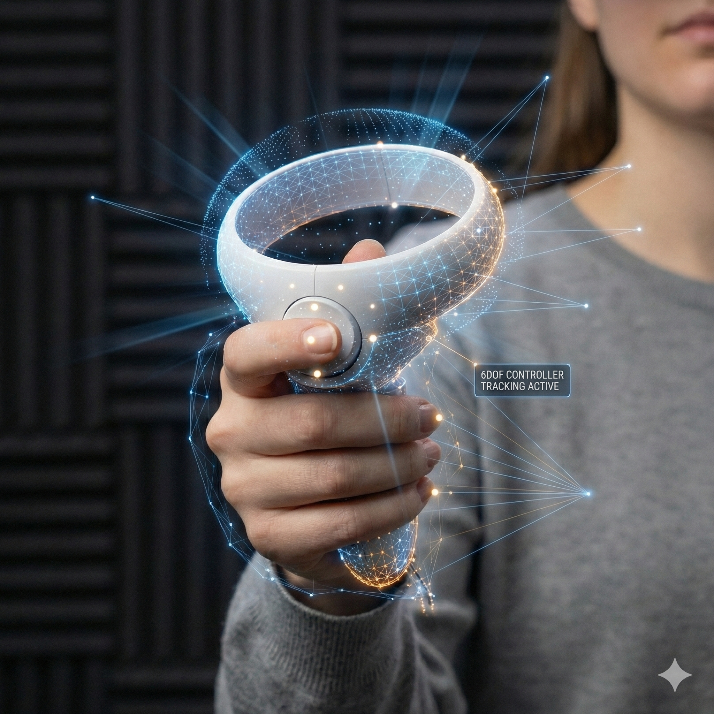

---
## Anatomische Zielsetzung des Hand-Tracking

Das Ziel des Hand-Trackings ist die digitale Abbildung einer hochkomplexen Biomechanik.

Nach **Grimm et al.** verfügt die menschliche Hand über **27 Freiheitsgrade (DOF)**:

- **6 DOF:** Position und Orientierung des Handrückens (Handwurzel).
- **21 DOF:** Die einzelnen Fingergelenke (Phalangen).

Die Herausforderung besteht darin, diese 27 Variablen in Echtzeit und mit hoher Präzision zu quantifizieren.

---
<!-- _class: img-right-->

## Kamerabasiertes / Optisches Tracking (Markenlos)
Dies ist der De-facto-Standard in modernen Consumer-Headsets (z. B. Oculus Quest, Leap Motion).

- **Basis:** Computer Vision (CV) und Machine Learning (ML).
- **Input:** RGB- oder Infrarot-Videostreams.
- **Workflow:** **Reimer et al.** beschreiben den Prozess am Beispiel des *MediaPipe-Frameworks*.

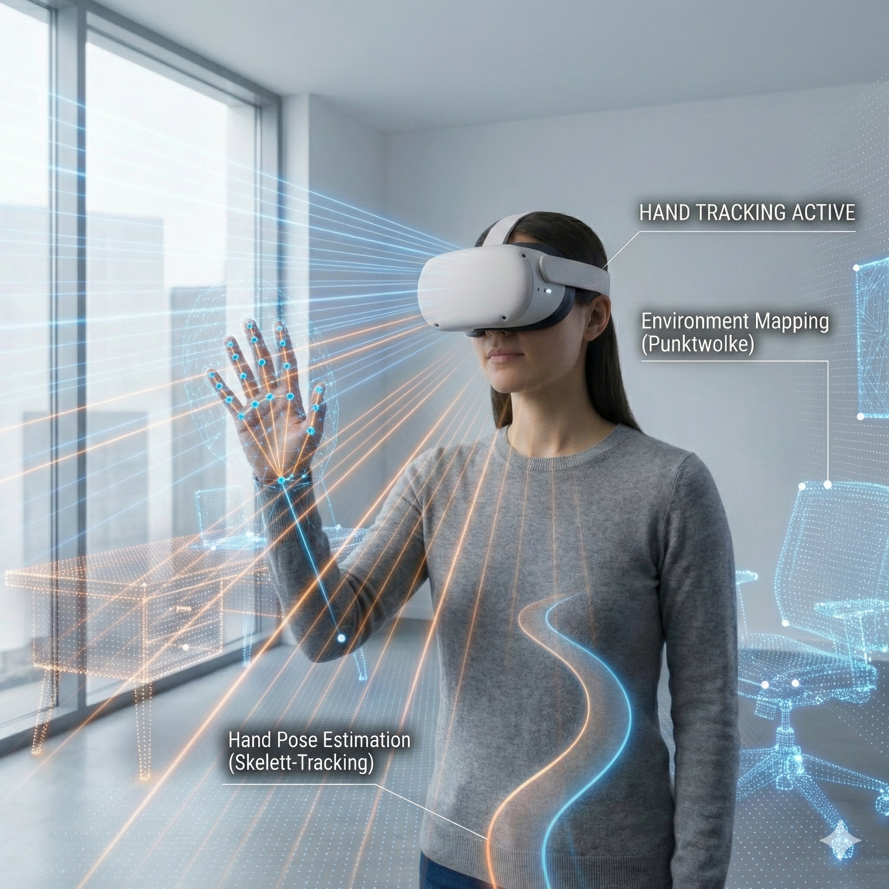

---

## Integrierte Systeme vs. RGB-basierte Lösungen

**1. Integrierte Systeme (HMD-basiert)**
-   **Technik:** Nutzen spezialisierte Sensoren (Infrarot/Tiefenkameras), die direkt im Headset oder als Aufsatz (z. B. Leap Motion) verbaut sind.
-   **Stärke:** Laut Reimer et al. (2023) extrem präzise im direkten Nahbereich für feine Manipulationen.
-   **Grenzen:** Das Tracking bricht oft ab, wenn die Hände den Nahbereich verlassen oder sich gegenseitig verdecken (Okklusion).

---

**2. RGB-basierte Systeme (Extern)**
-   **Technik:** Nutzen Standard-Kameras (Webcams) und KI-Frameworks (z. B. MediaPipe) zur Bildanalyse.
-   **Vorteil:** Nach Reimer et al. (2023) ermöglichen sie stabiles Tracking über größere Distanzen (bis zu 3 Meter) und sind hardwareunabhängig.

---
## Herausforderungen RGB-basierter Systeme

Ein Hauptproblem von RGB-Kameras ist das Fehlen von Tiefeninformationen (Z-Achse), da sie nur ein flaches 2D-Bild liefern.

**Lösung mittels Strahlensatz (nach Reimer et al., 2023)**
-   **Prinzip:** System schätzt die Tiefe math. statt zu messen.
-  **Referenz:** Physische Handgröße des Nutzers = bekannt (gemessen oder statistisch abgeleitet).
-   **Berechnung:** Strahlensatz: Vergleich der Hand im Bild mit realer Hand
-   *Ergebnis:* Präzise Positionierung im 3D-Raum, laut Reimer et al. (2023) bei > 75 cm oft genauer als integrierte Sensoren.

---
<!-- _class: img-right-->

### RGB-System
### MediaPipe Workflow: Schritt 1 - Detektion

Ein neuronales Netz analysiert den Frame und extrahiert die Handregion.
Es werden **21 Landmarks** (Schlüsselpunkte) identifiziert:
- Handwurzel (Wrist)
- Fingerknöchel (MCP)
- Fingerspitzen (Tips) und Zwischengelenke (PIP/DIP)

**Output des Netzes:**
1.  **2D-Landmarks:** $x, y$ Koordinaten im Pixelraum des Bildes.
2.  **3D-Landmarks:** Räumliche Position relativ zum geometrischen Zentrum der Hand (oft normiert).

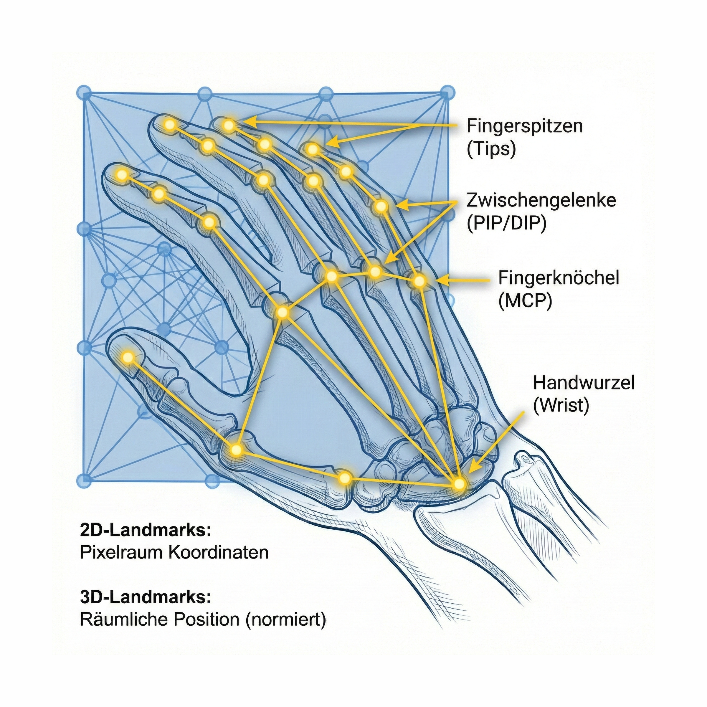

---

### MediaPipe Workflow: Schritt 2 - Größenschätzung

Problem: Eine monokulare Kamera (ohne ToF/Lidar) kann keine absolute Tiefe messen ("Scale Ambiguity"). Die reale Größe der Hand muss bekannt sein oder geschätzt werden.

**Lösungsansätze:**
1.  **Interne Berechnung:** Nutzung der vom neuronalen Netz vorhergesagten relativen 3D-Abstände.
2.  **Messung:** Manuelle Eingabe der realen Handlänge (Kalibrierung).
3.  **Statistische Ableitung:** Schätzung basierend auf der Körpergröße des Nutzers (Korrelation Handlänge $\leftrightarrow$ Körpergröße über Perzentile der Normalverteilung).

---
### MediaPipe Workflow: Schritt 3 - Tiefenschätzung

Zur Platzierung der Hand im virtuellen Raum (Abstand $d_R$) wird der **Strahlensatz (Intercept Theorem)** angewendet.

$$d_R = f \cdot \frac{l_{sr}}{l_{sm}}$$

- $d_R$: Distanz zur Kamera (Depth).
- $f$: Brennweite der Kamera (Focal Length).
- $l_{sr}$: Reale (bzw. geschätzte) Größe der Hand (Size Real).
- $l_{sm}$: Größe der Hand im Kamerabild (Size Monitor/Sensor).

---

### Systemvergleich: Integriert vs. RGB

| Feature | Integrierte Systeme (Quest/Leap) | RGB-Ansätze (MediaPipe) |
| :--- | :--- | :--- |
| **Sensorik** | Infrarot (IR) Stereo | Standard RGB (Monokular) |
| **Reichweite** | Nahbereich (Armlänge) | Fernbereich (bis 3m) |
| **Präzision** | Sehr hoch (bei Nähe) | Variabel (Kalibrierungsabhängig) |
| **Multi-User** | Oft limitiert (1-2 Hände) | Skalierbar (> 2 Hände) |
| **Robustheit** | Anfällig bei starkem Sonnenlicht | Anfällig bei schlechtem Licht |

---
<!-- _class: img-right-->

## Mechanisches Tracking (Datenhandschuhe)
Ältere, aber extrem präzise Verfahren zur Messung der **Fingerkrümmung**.
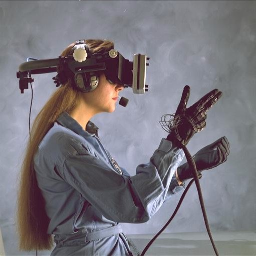

---

**Verfahren:** 
- **Lichtwellenleiter (z. B. Data Glove):**
    - Glasfasern auf den Fingern.
    - Biegung $\rightarrow$ Lichtaustritt $\rightarrow$ Intensitätsabfall an der Fotozelle.
- **Dehnungsmessstreifen (z. B. CyberGlove):**
    - Änderung des elektrischen Widerstands bei Materialdehnung.
- **Exoskelette:**
    - Messung über Potentiometer oder Seilzüge.

---

> **Wichtig:** Diese Sensoren messen nur die Finger relativ zur Hand. Für die 6 DOF des Handrückens im Raum ist ein externer Tracker (optisch/magnetisch) zwingend erforderlich.

---
<!-- _class: img-right-->

## Optisches Tracking mit Marken
Einsatz externer Kamerasysteme zur Erfassung definierter Punkte.

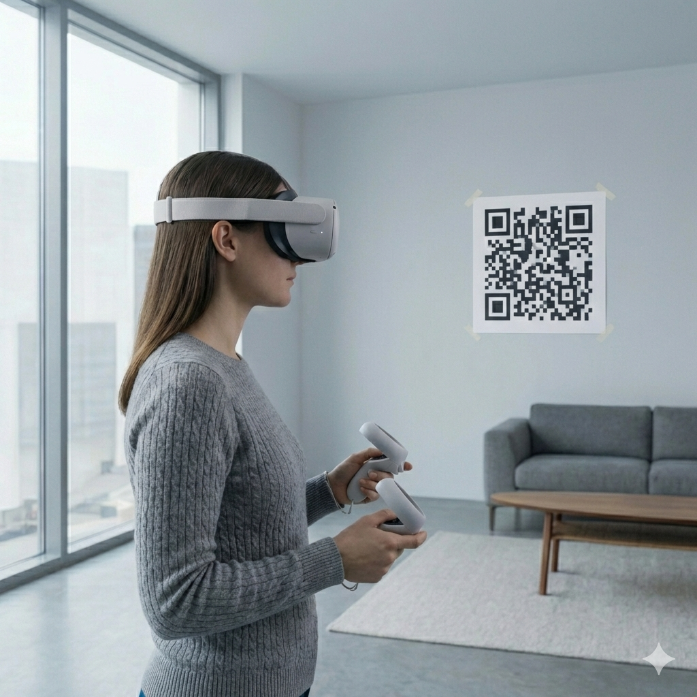

---
<!-- _class: img-right-->

***Passive Marken (Retroreflexion):***
- Klassisches Motion Capture (MoCap).
- Kugeln reflektieren IR-Licht; Position wird trianguliert.

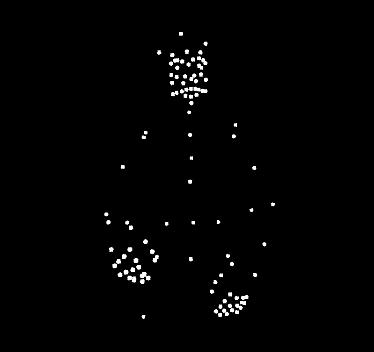

---

**Aktive Marken (LEDs):**
- Handschuhe mit verbauten Leuchtdioden (z. B. MIT LED Glove).
- **Identifikation:** Sequenzielle Blinkmuster erlauben die Unterscheidung einzelner Finger auch bei Überlappung.

---

### Technische Herausforderungen (Challenges)

Unabhängig vom Verfahren limitieren folgende Faktoren die Visualisierung:

1.  **Verdeckung (Occlusion):**
    - Selbstverdeckung (Faust ballen) oder Fremdverdeckung.
    - Lösung: Hybride Systeme (Kamera + IMU) oder KI-Infilling.
2.  **Anatomische Varianz:**
    - Unterschiedliche Fingerdicken und Gelenkpositionen führen bei starren Modellen zu Offset-Fehlern.
3.  **Tracking-Bereich (FoV):**
    - Hände verlassen das Sichtfeld der HMD-Kameras (kritisch bei Überkopf-Arbeiten oder Notizen am "Gürtel").

---

### Diskussion & Transfer
**Szenario:** Wir entwickeln ein Tool für die virtuelle Archäologie, bei dem Nutzer fragile Artefakte präzise mit den Fingern vermessen müssen.

- Welches Tracking-Verfahren (Markenlos vs. Datenhandschuh) wählen Sie?
- Begründen Sie dies anhand der Parameter **Präzision**, **Verdeckung** und **Hardware-Aufwand**.

---

<!-- _class: fullscreen -->

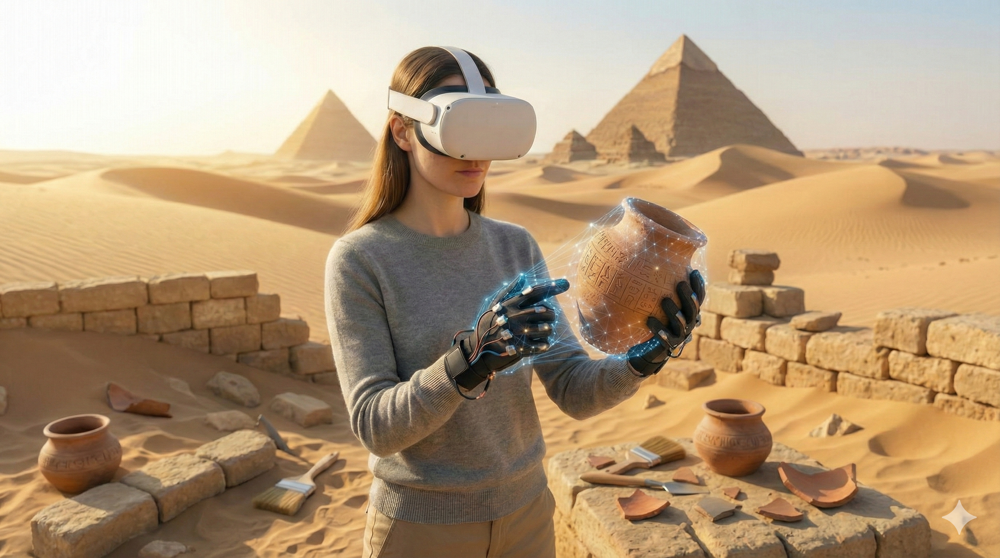

---
<!-- _class: img-right-->

# Eye-Tracking in VR
Erfassung der Blickrichtung zur Optimierung (Foveated Rendering).

**Nutzeranalyse:** Worauf schauen Stadtplaner zuerst? [LaValle, 2019]. Ermöglicht Blick-basierte Interaktion (Selektion durch Anschauen).
---> Siehe kapitel [Biologie](#biologische-zielplattform-der-organismus)

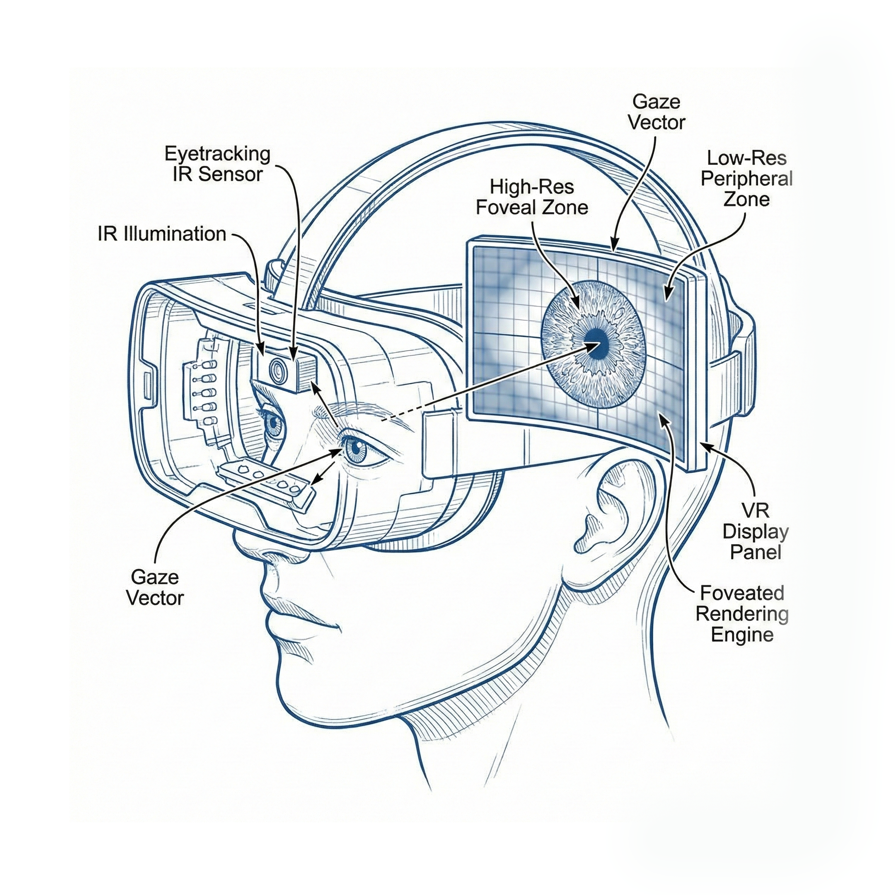

---

# Herausforderungen und Fehler
- Reflektierende Fassaden oder extremes Sonnenlicht stören das Tracking.
- **Okklusion:** Verdeckung von Sensoren durch Körper/Möbel.
- Predictive Tracking sagt nächste Position voraus, um Latenz zu maskieren, kann aber zu "Ghosting" führen.

---

# Diskussionsfragen
- Warum ist die Achse-Winkel-Repräsentation den Euler-Winkeln in VR überlegen?
- Wie beeinflusst ungenaues Tracking die Wahrnehmung von Distanzen in einem Stadtmodell?
- Wird Inside-Out-Tracking externe Sensoren langfristig ersetzen?

---

# Mögliche Prüfungsfragen
1. Definieren Sie "6 Degrees of Freedom" (6 DoF).
2. Beschreiben Sie das Prinzip von SLAM.
3. Nennen Sie Vor- und Nachteile von Outside-In Tracking für stationäre Geovis-Labore.

---
<!-- _class: structural-->
# Optik & HMDs: Das Fenster zur Welt
Wie Optik und Displays das Bild zurück zum Nutzer bringen.

---

# HMDs: Die Schnittstelle
HMDs sind die primäre Schnittstelle zwischen Mensch und Maschine (HCI) [LaValle, 2019].

Sie kombinieren Displaytechnologie mit spezieller Optik. Hardware definiert die Qualität der Wahrnehmungsillusion.

---

# Optik: Warum Linsen?
Das Auge kann Objekte in wenigen Zentimetern Entfernung nicht fokussieren. Linsen brechen das Licht so, dass das Display für das Auge "unendlich" weit entfernt scheint (virtuelles Bild) [LaValle, 2019].

---
<!-- _class: img-right-->

# Fresnel-Linsen
Einsatz in den meisten modernen HMDs, um Gewicht zu reduzieren [LaValle, 2019].

**Nachteil:** Verursachen "God Rays" (Lichtstreuung) bei kontrastreichen Szenen. In Geo-Anwendungen müssen wir Kontraste daher sorgfältig wählen.

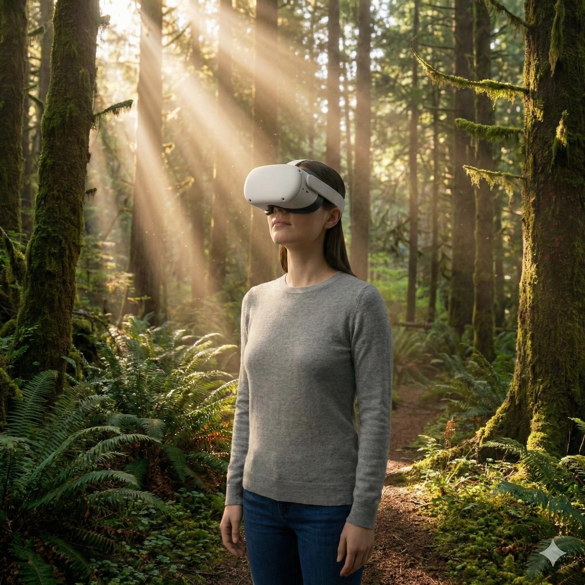

---

# Begriffserklärung: Fresnel-Linse
> Eine Linse, die aus konzentrischen Ringen besteht. Sie ist viel flacher und leichter als eine normale Glaslinse, hat aber das gleiche Brennverhalten.

---

# Optische Aberrationen
- **Chromatische Aberration:** Farbsäume, da Lichtwellenlängen verschieden stark gebrochen werden.
- **Sphärische Aberration:** Unschärfe am Rand der Linse [LaValle, 2019].
- Ausgleich durch Software-Pre-Distortion.

---

# Korrektur optischer Verzerrungen
Linsen erzeugen kissenförmige Verzerrungen. Das Bild wird am Display vorab **tonnenförmig (Barrel Distortion)** verzerrt, damit es nach dem Durchgang durch die Linse korrekt erscheint [LaValle, 2019].

---

# Display-Technologien
- **OLED:** Echte Schwarzwerte, schnellere Schaltzeiten, reduziert Motion Blur.
- **LCD:** Höhere Pixeldichte (weniger Screen Door Effect) [LaValle, 2019].
- Für Geo-Strukturen ist die Reduzierung des Pixelrasters vorrangig.

---
<!-- _class: img-right-->

# Auflösung und Field of View (FoV)
Ein hohes **FoV (>100 Grad)** ist für Immersion entscheidend [LaValle, 2019].

Die Auflösung wird in **Pixel pro Grad (PPD)** gemessen. In der VR bestimmt PPD, ab welcher Entfernung Text auf Schildern lesbar ist.

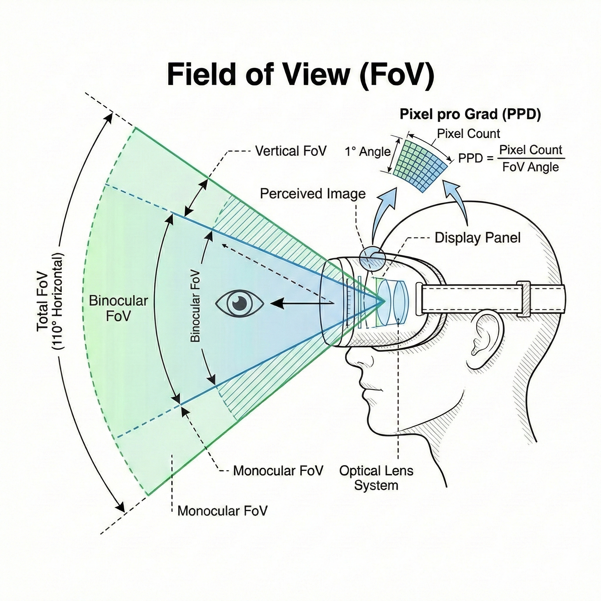

---

# Begriffserklärung: Field of View (FoV)
> Das Sichtfeld – also wie viel Grad du von der virtuellen Welt siehst, ohne den Kopf zu drehen. Ein größeres FoV fühlt sich natürlicher an.

---
<!-- _class: structural-->
# Interaktionsformen
Interaktion steigert das Gefühl der "Beteiligung" an der VR.
Je mehr ich an einer VR beteiligt bin, desto immersiver fühlt es sich an.

---

# Interaktionsformen: Navigation
- Physisches Gehen oder künstliche Fortbewegung (Teleportation).
- **Wayfinding:** Orientierungshilfen (Mini-Maps) in großen Welten [Mulders et al., 2020].
- Erhaltung des Nord-Bezugs ist kritisch.

---
<!-- _class: fullscreen -->

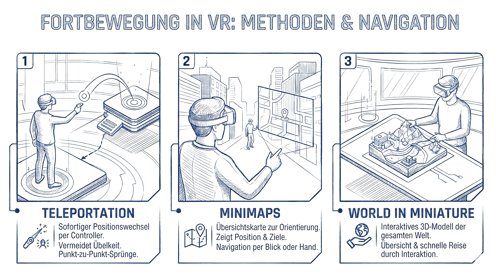

---

# Selektion und Manipulation
- **Selektion:** Auswahl durch Blicken (Gaze) oder Laser-Pointer.
- **Manipulation:** Drehen, Skalieren oder Verschieben von Geo-Objekten.
- Interaktion muss intuitiv sein, um kognitive Last gering zu halten.

---
# Selektion und Manipulation in VR
## Vergleich der Interaktionsmetaphern

**Definitionen nach Dörner et al.**
- **Selektion:** Das Auswählen einer Entität (Objekt, Punkt, Fläche) oder einer Teilmenge der virtuellen Welt.
- **Manipulation:** Die Veränderung der Objektparameter (Position, Orientierung, Größe, Form) nach der Selektion.
- **Zusammenhang:** Beide Prozesse sind eng gekoppelt; eine effektive Manipulation setzt eine präzise Selektion voraus.

---
<!-- _class: fullscreen -->

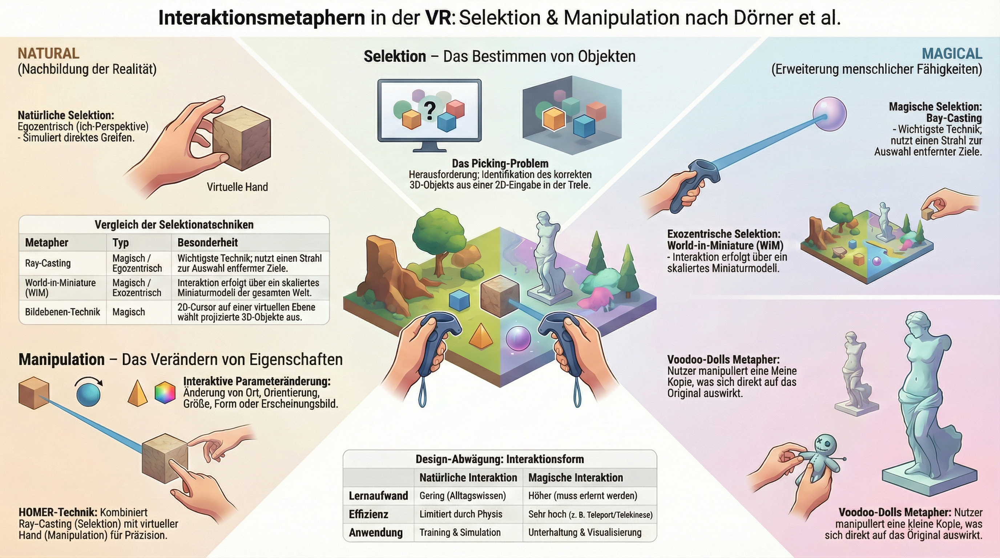

---
>Überblick über Selektions- und Manipulationsmethoden
1. Die Gaze-Methode (Blicksteuerung)
2. Controller-basierte Methoden
3. Hand-Gesten-Methode (Natural Interaction)

**Ergänzend:**
- Magische Interaktion
- Voodoo-Dolls Manipulation
- Worlds in Miniature
- Gorilla Arms

---
<!-- _class: img-right-->

# 1. Die Gaze-Methode (Blicksteuerung)

Diese Methode nutzt die Blickrichtung als Zeiger:
- Eye-Tracking
- Kopf-Orientierung

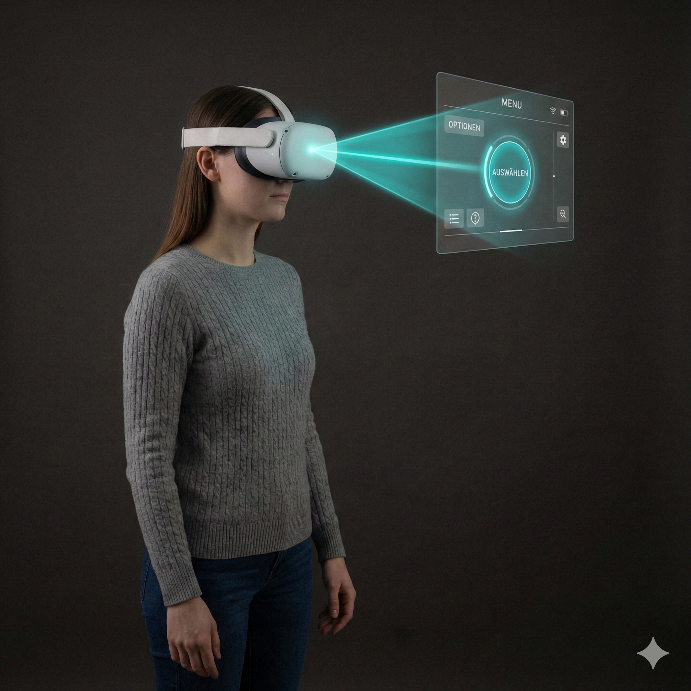

---

**Vorteile der Gaze-Methode**
- **Geschwindigkeit:** Das Auge kann sehr schnell fokussieren und Ziele erfassen.
- **Hände frei:** Ermöglicht Interaktion, wenn die Hände beschäftigt sind.

---
<!-- _class: img-right-->

**Nachteile & Herausforderungen der Gaze-Methode**
- **Midas-Touch-Problem (nach Dörner et al.):** Da wir ständig wohin blicken müssen, ist es schwierig zu unterscheiden, ob der Nutzer ein Objekt nur betrachten oder auswählen möchte. Ohne expliziten Auslöser (z. B. Zwinkern, Button) wird unbeabsichtigt alles "aktiviert", was angesehen wird.
- **Ermüdung:** Längere Nutzung zur Steuerung kann die Augenmuskulatur belasten.

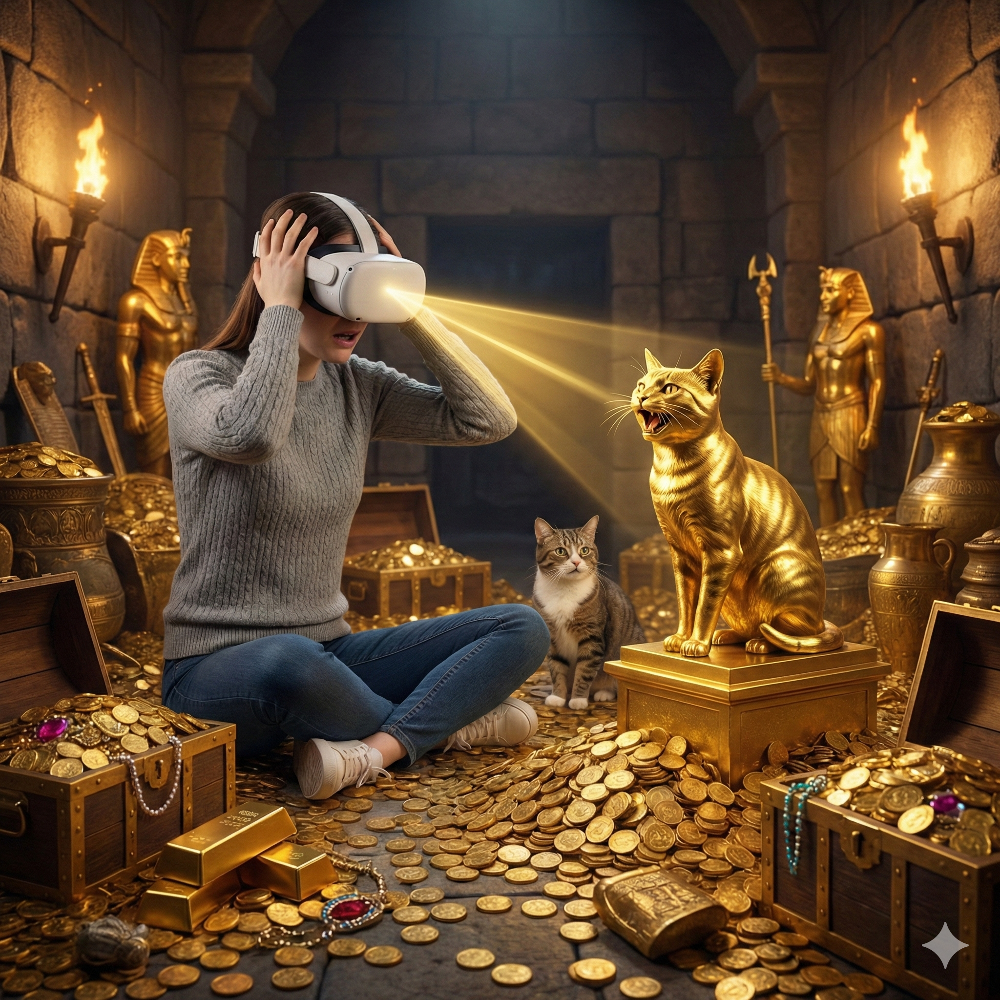

---
<!-- _class: img-right-->

# 2. Controller-basierte Methoden
(z. B. Ray-Casting / Zeigestrahl)

Der Nutzer hält ein physisches Gerät (Flystick, Wand, Game-Controller), dessen Position und Tasten genutzt werden.

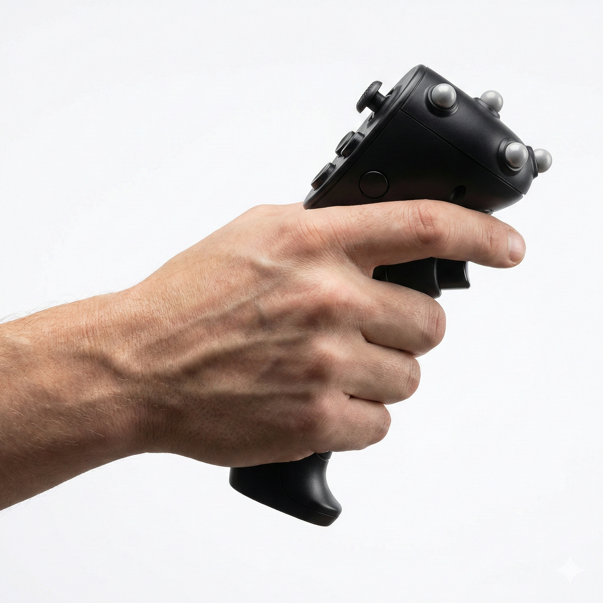

---

**Vorteile controllerbasierter Methoden**
- **Reichweite (nach Dörner et al.):** Techniken wie *Ray-Casting* (Zeigestrahl) erlauben die Selektion entfernter Objekte ("Action at a Distance").
- **Haptik:** Physische Tasten bieten klares taktiles Feedback für Bestätigungen.
- **Remapping (nach LaValle):** Controller ermöglichen "magische" Interaktionen. Eine kleine Bewegung des Daumens kann eine große Bewegung in VR auslösen, was Ermüdung reduziert.

---

**Nachteile controllerbasierter Methoden**
- **Winkelungenauigkeit (nach Dörner et al.):** Beim Ray-Casting sinkt die Präzision mit der Entfernung (Hebelwirkung; Zittern der Hand wirkt sich stark aus).
- **Abstraktion:** Es ist ein "indirektes" Zeigegerät, das erlernt werden muss (Hand-Auge-Koordination).

---
<!-- _class: img-right-->

# 3. Hand-Gesten-Methode (Natural Interaction)

Nutzung der bloßen Hände (Virtual Hand) ohne physische Controller, erfasst durch Kameras (z. B. Leap Motion, Quest, RGB-Kameras).

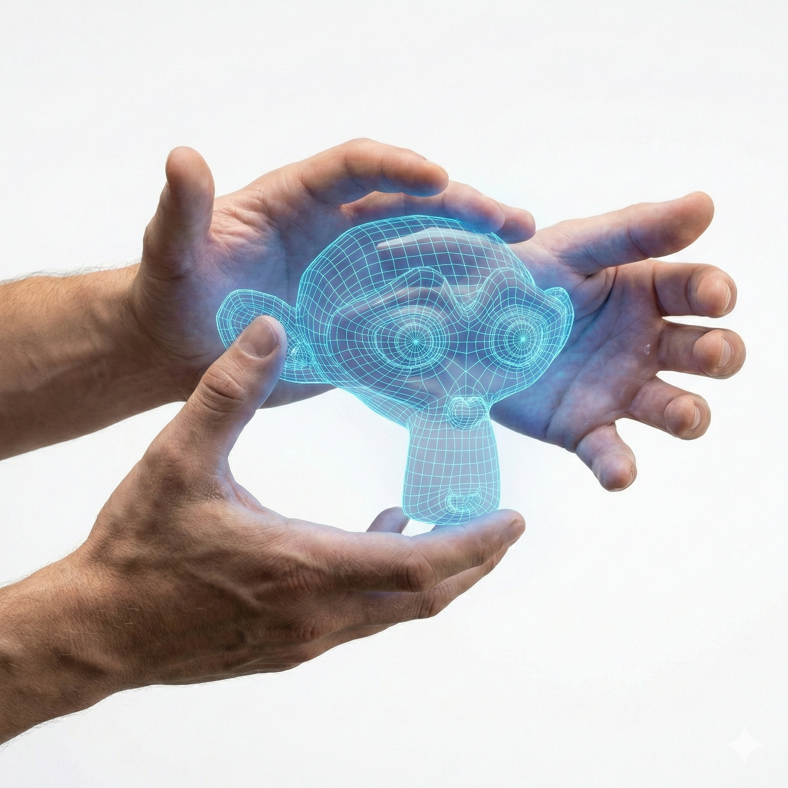

---

**Vorteile der Hand-Gesten**
- **Intuitivität (nach Dörner et al.):** Entspricht als *Natural User Interface* der Alltagserfahrung. Greifen und Zeigen sind natürliche Bewegungen.
- **Hardware-Unabhängigkeit (nach Reimer et al.):** Moderne Ansätze (z. B. MediaPipe) ermöglichen Tracking mittels einfacher RGB-Kameras ohne teure Spezialhardware.
- **Multi-User (nach Reimer et al.):** RGB-Systeme können oft mehr als zwei Hände gleichzeitig tracken, was für kollaborative Szenarien (Co-located VR) essenziell ist.

---

**Nachteile und Herausforderungen der Hand-Gesten**

**Technische Grenzen (nach Reimer et al.)**
- **Reichweite:** Integrierte Systeme (z. B. in HMDs) verlieren das Tracking oft außerhalb der Armlänge (> 0,75 m). RGB-Systeme sind hier robuster (bis 3 m), benötigen aber Größenkalibrierung für korrekte Tiefe.
- **Okklusion:** Wenn Finger sich gegenseitig verdecken oder die Hand rotiert, bricht das Tracking oft ab.

---

**Ergonomie & Feedback (nach LaValle und Dörner et al.)**
- **Gorilla Arms (nach LaValle):** Das freie Halten der Arme in der Luft ohne physische Stütze führt schnell zu Ermüdung. Die "Minority Report"-Schnittstelle ist in der Praxis oft zu anstrengend. Siehe auch [Gorilla Arms](#hci-das-gorilla-arms-phänomen)
- **Fehlende Haptik (nach Dörner et al.):** Das Greifen ins Leere (ohne physischen Widerstand) erschwert die präzise Manipulation ("Greifen von Luft").

---
<!-- _class: fullscreenText -->
# Zusammenfassender Vergleich

| Kriterium | Gaze (Blick) | Controller (Ray) | Hand-Gesten |
| :--- | :--- | :--- | :--- |
| **Präzision** | Hoch (Fokus) | Mittel (Distanzabhängig) | Variabel (Tracking-Qualität) |
| **Reichweite** | Unbegrenzt | Hoch (Zeigestrahl) | Begrenzt (Armlänge/Kamera) |
| **Feedback** | Keines | Taktil (Vibration/Taste) | Nur visuell (kein Widerstand) |
| **Problem** | Midas Touch | Lerhurde (Indirekt) | Gorilla Arms / Okklusion |

---

> **Fazit:**

Controller eignen sich nach **LaValle** gut für längere Sitzungen (weniger Ermüdung durch Remapping), während Hand-Gesten nach **Dörner et al.** die höchste Natürlichkeit bieten, aber unter fehlender Haptik und Tracking-Aussetzern (**Reimer et al.**) leiden.

---
# Magische Interaktion

**Konzept und Definition**
- **Grundsatz nach Dörner et al.:** Magische Interaktionen nutzen Metaphern, die physikalische Gesetze der realen Welt bewusst ignorieren oder erweitern.
- **Abgrenzung:** Sie stehen im Gegensatz zur *natürlichen Interaktion*, welche versucht, die reale Welt und deren Beschränkungen 1:1 zu simulieren.
- **Zielsetzung nach LaValle:** Anstatt dem *Universal Simulation Principle* zu folgen, sollten VR-Systeme dem Nutzer "Superkräfte" verleihen, um Interaktionen effizienter als in der Realität zu gestalten.

---
<!-- _class: fullscreen -->

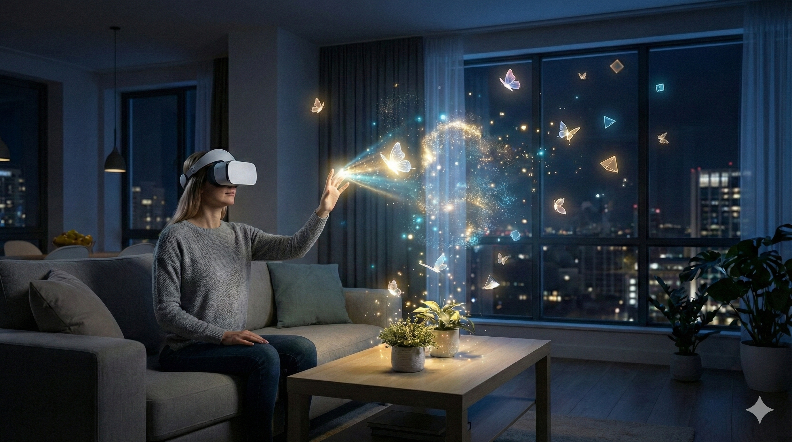

---

**Beispiele für magische Techniken (nach Dörner et al.)**
- **Navigation:** Teleportation an einen neuen Ort ohne physisches Gehen.
- **Manipulation:** "Go-Go-Technik" (nicht-lineare Verlängerung der Arme), um entfernte Objekte zu greifen ("Action at a Distance").
- **Systemsteuerung:** Exozentrische Techniken wie *World-In-Miniature* (WIM), bei der die Welt als kleines Modell in der Hand manipuliert wird.

---

**Vor- und Nachteile magischer Techniken**
- **Vorteil:** Erlaubt neue Funktionalitäten und effizienteres Arbeiten (z. B. Greifen ohne Laufen).
- **Nachteil:** Muss vom Nutzer erlernt werden, da keine direkte Entsprechung im Alltagswissen existiert (geringere intuitive Nutzbarkeit).

---
<!-- _class: img-right-->

# Voodoo Doll Interaktion
## Exozentrische Manipulation durch Skalierung

**Konzept (nach Dörner et al.)**
- **Definition:** Die Voodoo-Doll-Technik ist eine exozentrische Interaktionstechnik, die primär auf dem Prinzip der Skalierung basiert.
- **Abgrenzung zur WIM:** Im Gegensatz zur *World-In-Miniature* (WIM), bei der die gesamte Umgebung verkleinert wird, werden hier laut **Dörner et al.** nur ausgewählte Objekte skaliert und dupliziert.

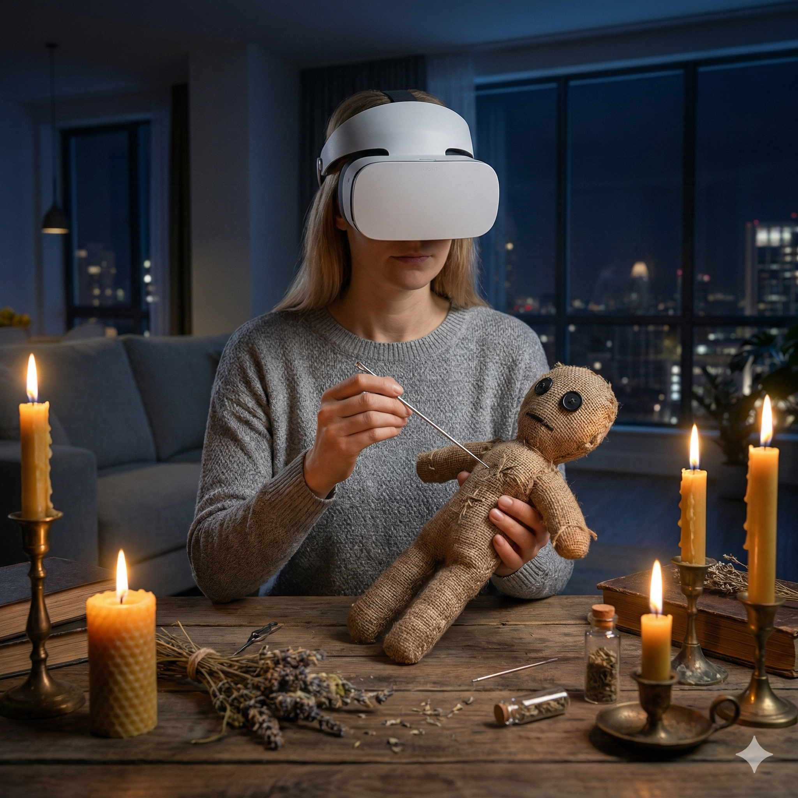

---

**Funktionsweise**
- **Interaktion:** Der Nutzer interagiert mit einer handlichen, skalierten Kopie des Zielobjekts (der "Puppe"), die er in der Hand hält.
- **Übertragung:** Jede Manipulation an dieser Kopie (Rotation, Positionierung) wird instantan auf das reale, oft entfernte Originalobjekt in der Szene übertragen.

---

**Vorteile (nach Dörner et al.)**
- **Effizienz:** Durch die Skalierung wird gewährleistet, dass der Nutzer Objekte unterschiedlichster Größe (auch sehr große Gebäude oder winzige Teile) effektiv manipulieren kann.
- **Komfort:** Die Technik bringt das Interaktionsobjekt in den direkten, komfortablen Greifraum des Nutzers, unabhängig von der Position des Originals.

---
# World in Miniature (WIM)
## Konzept und Abgrenzung zur Voodoo-Doll-Technik

**World in Miniature (nach Dörner et al. und Stoakley et al.)**
- **Konzept:** Die gesamte virtuelle Umgebung (oder ein großer Sektor) wird so stark herunterskaliert, dass sie als Miniaturmodell in den greifbaren Arbeitsbereich (z. B. auf die Hand) des Nutzers passt.
- **Perspektive:** Es handelt sich um eine **exozentrische Technik** ("God’s Eye View"), bei der der Nutzer die Szene von außen betrachtet, oft während er noch in der lebensgroßen Welt steht (hybride Sicht).

---
<!-- _class: fullscreen -->

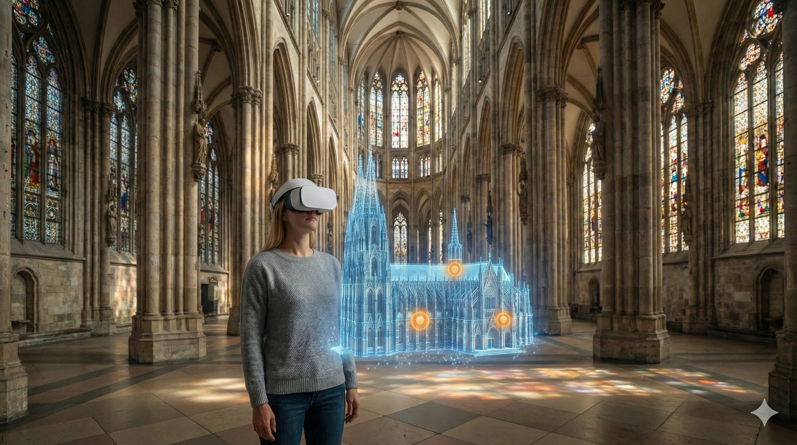

---
>**Nutzen der World in Miniature**

Ermöglicht die **Selektion** und Manipulation von Objekten, die im realen Maßstab verdeckt oder weit entfernt sind, sowie die schnelle **Navigation** durch Versetzen der eigenen Position im Modell.

---

**Abgrenzung zur Voodoo-Doll-Technik (nach Dörner et al.)**
- **Skalierungs-Fokus:** Im Gegensatz zur WIM, die die **gesamte Umgebung** (den Kontext) verkleinert, werden bei der Voodoo-Doll-Technik nur **ausgewählte Einzelobjekte** skaliert und dupliziert.
- **Interaktionsziel:**
  - *WIM:* Orientierung, Navigation und grobe Anordnung im Raum.
  - *Voodoo Doll:* Präzise **Manipulation** eines spezifischen Objekts. Der Nutzer hält eine handliche Kopie ("Puppe") in der Hand; jede Änderung daran wirkt sich sofort auf das (oft entfernte oder riesige) Original aus.
---
<!-- _class: img-right-->

# Das "Gorilla Arms"-Phänomen
Ermüdung der Armmuskulatur durch Arbeiten in der Luft ohne Stütze [LaValle, 2019].

**Strategie:** UI-Elemente so platzieren, dass sie aus dem Handgelenk bedienbar sind. Remote-Interaktion nutzen.

---
<!-- _class: img-right-->

# Folgerungen für das Design von 3D-Interfaces
Vermeidung von 2D-Menüs, die "am Kopf kleben". 

**"Diegetic UI":** Das Interface ist Teil der Welt (z.B. ein Klemmbrett) [Mulders et al., 2020]. Erhöht Akzeptanz in der Stadtplanung.

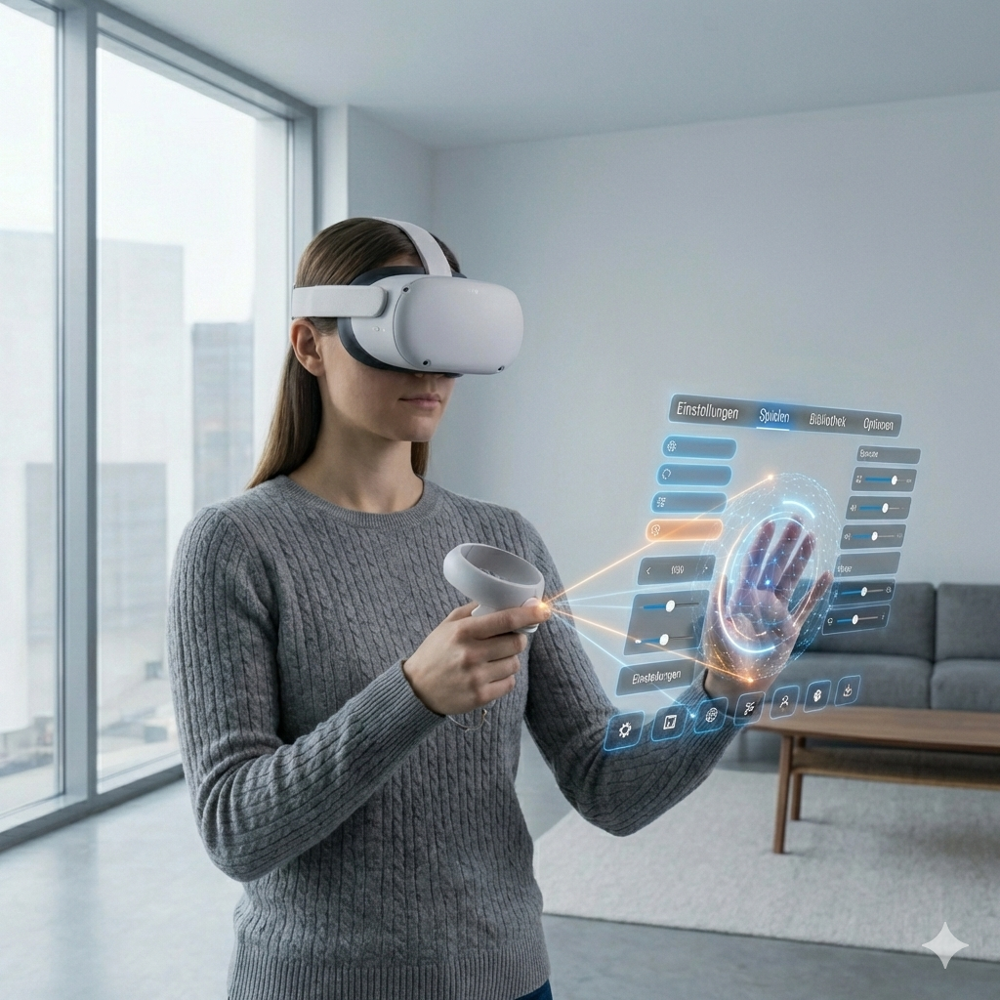

---

# Diskussionsfragen
- Warum sind Linsen sowohl Segen als auch Fluch für VR-Systeme?
- Wie gestalten wir ein VR-GIS Interface, das 8 Stunden ohne Ermüdung nutzbar ist?
- Blicksteuerung vs. Hand-Controller: Was ist für Geovisualisierer effizienter?

---

# Mögliche Prüfungsfragen
1. Erläutern Sie das Problem der chromatischen Aberration.
2. Was versteht man unter "Pre-Distortion" im Kontext der Optik?
3. Beschreiben Sie das "Gorilla Arms"-Problem und eine Strategie zu dessen Vermeidung.

---
<!-- _class: structural-->
# Großsysteme & Kollaboration
HMDs ermöglichen einen kostengünstigen Einstieg in die VR. 
- Welche Systeme gibt es außerdem?
- Welche Vor- und Nachteile bringen andere Systeme mit sich?

Alternative Systeme:
- CAVE & Powerwalls
- Desktop- & Mobile-VR

---
# Kollaborative VR: CAVE & Powerwalls

>HMDs isolieren den Einzelnen. Für gemeinsame Arbeit brauchen wir andere Systeme.

---

# CAVE: Die immersive Höhle
Ein Raum mit 3 bis 6 Projektionsflächen (Wände, Boden, Decke) [Mulders et al., 2020].

Nutzer tragen Shutter-Brillen, sehen aber weiterhin ihre Kollegen.
**Vorteile:**
- Natürliche Kommunikation
- Interaktion mit physischen Objekten
- Gemeinsame Erfahrung
- Großräumige Erfahrung

---
<!-- _class: fullscreen -->

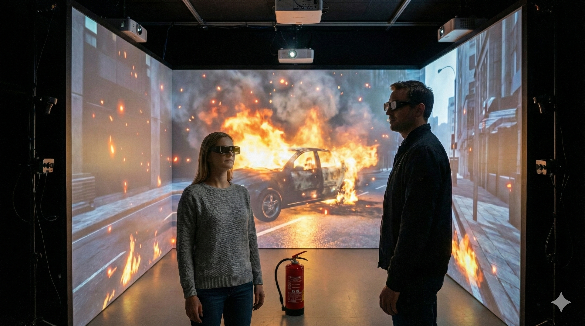

---

# Funktionsweise der CAVE
Ein Tracking-System erfasst die Kopfposition eines Hauptnutzers. Die Perspektive wird exakt für diesen berechnet. Hoher Aufwand für Synchronisation und **Blending** (nahtlose Kanten) [Mulders et al., 2020].

---
<!-- _class: fullscreen -->

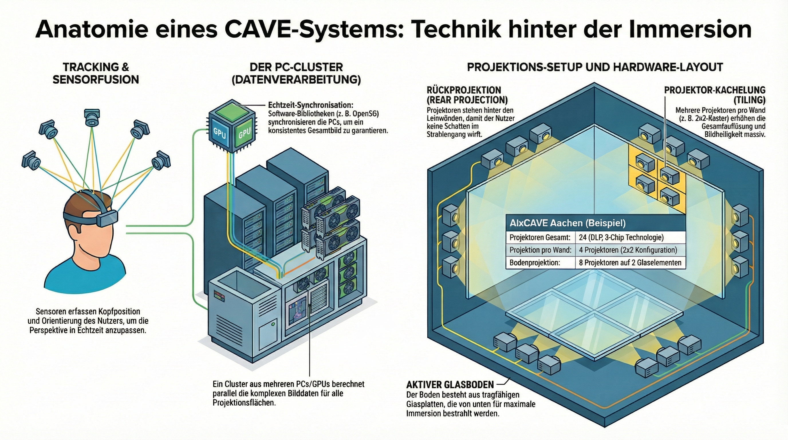

---

<video src="img/mavel-lab.mp4" controls></video>

###### MAVEL Lab in Schweinfurt

---

# Powerwalls
Großflächige, ebene Projektionswände. Fokus auf extrem hohe Auflösung für Analyse (z. B. LIDAR-Punktwolken). Weniger immersiv, aber besser für Textarbeit und GIS-Analysen.

---
<!-- _class: fullscreen -->

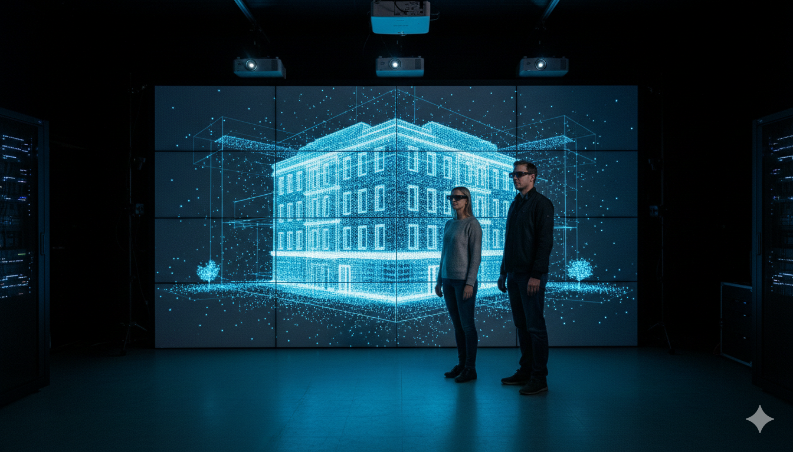

---
<!-- _class: structural-->

# Desktop- und Mobile VR
- **Desktop-VR:** 3D-Engines am Monitor. Geringe Immersion, hohe Zugänglichkeit [Mulders et al., 2020].
- **Mobile VR:** Smartphones (Cardboard). Ermöglicht VR-Exkursionen ohne teures Equipment.

---
# Desktop VR (Nicht-immersive VR)
## Stereoskopie am Bildschirmarbeitsplatz

**Konzept und Einordnung (nach Dörner et al.)**
- **Definition:** Desktop-Systeme nutzen herkömmliche Monitore zur Darstellung. Der Nutzer blickt wie durch ein "Fenster" in die virtuelle Welt, bleibt aber visuell in der realen Umgebung verankert.
- **Klassifizierung:** Solche Systeme werden oft als **nicht-immersive VR** bezeichnet, da keine vollständige visuelle Isolation von der Außenwelt (wie bei HMDs) stattfindet.

---

**Technische Umsetzung: Aktiv-Stereo (nach Dörner et al.)**
- **Shutterbrillen:** Zur 3D-Darstellung werden aktive Brillen genutzt, die synchron zum Monitor abwechselnd das linke und rechte Auge abdunkeln (zeitliches Multiplexing).
- **Hardware-Anforderung:** Der Monitor muss eine hohe Bildwiederholrate (mindestens **120 Hz**) bieten, um jedem Auge flimmerfreie 60 Bilder pro Sekunde zu liefern.
- **Head-Tracking:** Um dennoch einen starken räumlichen Eindruck zu erzeugen, wird oft die Kopfposition verfolgt, um die Perspektive auf dem Bildschirm dynamisch anzupassen (Bewegungsparallaxe).

---
<!-- _class: fullscreen -->

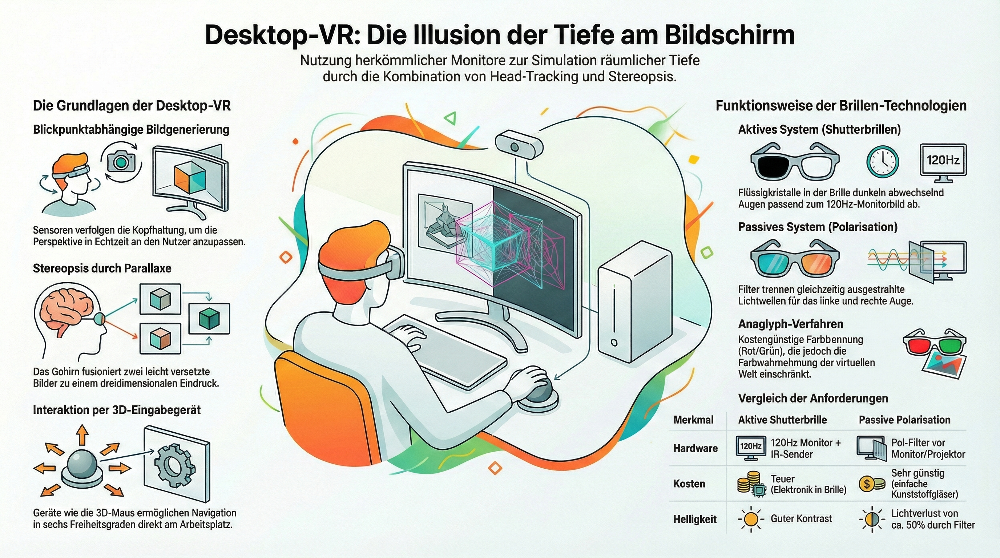

---
# Mobile VR & Standalone-Systeme
## Entwicklung und Eigenschaften

**Grundlagen und Entstehung**
- **Smartphone-Revolution (nach LaValle):** Die aktuelle Generation der VR-Systeme wurde maßgeblich durch Fortschritte in der Smartphone-Technologie (Displays, Sensoren, Rechenleistung) ermöglicht.

---

## Demokratisierung (nach LaValle)
Systeme wie *Google Cardboard* oder *Samsung Gear VR* (Smartphone-Halterungen) haben VR für Millionen von Menschen zugänglich gemacht, ähnlich wie die Verbreitung von Webbrowsern.

---
<!-- _class: fullscreen -->

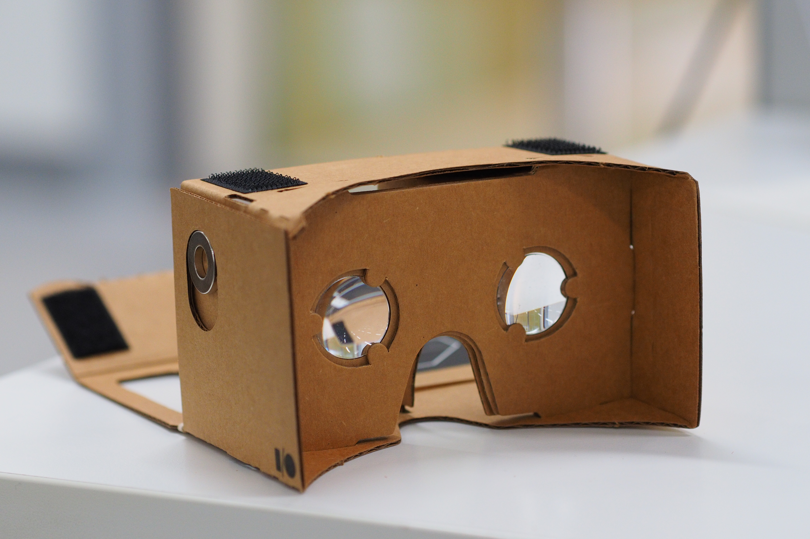

###### Von othree - Google Cardboard, CC BY 2.0, https://commons.wikimedia.org/w/index.php?curid=40703922

---

## Mobilität (nach Dörner et al.)
Mobile HMDs ermöglichen den Aufbau von Visualisierungssystemen, die nicht stationär gebunden sind, und bieten flexible Einsatzmöglichkeiten.

---

**Vom 3-DoF zum 6-DoF (nach Pinheiro de Sousa et al.)**
- **Frühe Systeme:** Ältere mobile Lösungen wie die *Samsung GearVR* waren oft auf **3-DoF** (nur Orientierungstracking) limitiert.
- **Moderne Standalone-Systeme:** Aktuelle Headsets (wie *Oculus Quest*) nutzen **Inside-Out-Tracking** (SLAM-basiert), um volle **6-DoF** (Position und Orientierung) ohne externe Sensoren zu ermöglichen.
- = "erweitertes Smartphone" 

---

# Systemvergleich
| System | Immersion | Kollaboration | Geovis-Task |
| :--- | :--- | :--- | :--- |
| HMD | Sehr hoch | Gering | Einzel-Training |
| CAVE | Hoch | Sehr hoch | Team-Planung |
| Powerwall | Mittel | Hoch | Datenanalyse |
| Desktop | Niedrig | Mittel | Aufbereitung |
| Cardboard | Gering | Gering | Reine Visualisierung |

---

# Strategische Evaluation
- **Bürgerbeteiligung:** Desktop-VR für Reichweite; CAVE für Workshops.
- **Wirtschaftlichkeit:** CAVE erfordert Wartung; HMDs sind günstig aber kurzlebig.
- Die Hardware muss dem sozialen Kontext folgen [Mulders et al., 2020].

---

# Diskussionsfragen
- Warum ist die CAVE trotz HMD-Boom in der Industrie noch relevant?
- Wann reicht Desktop-VR für eine geovisualisierte Analyse aus?
- Holografie vs. VR-Brille: Wer gewinnt den Massenmarkt?

---

# Mögliche Prüfungsfragen
1. Erläutern Sie das Funktionsprinzip einer CAVE.
2. Nennen Sie zwei Vorteile von Powerwalls gegenüber HMDs.
3. Skizzieren Sie die Systemvergleichstabelle.

---
<!-- _class: structural-->

# Zukunft der Geovisualisierung
Wo führt uns die Virtual-Reality in den nächsten (zehn) Jahren hin?

---

# XR-Unification
Die Grenzen zwischen VR, AR und MR werden durch universelle Hardware verschwinden [LaValle, 2019]. **XR** wird zum Standardbegriff.

Innovationen wie **Waveguides und HOEs** könnten HMDs auf Brillengröße schrumpfen lassen.

---

# Zunkunft: XR als neuer Standardbegriff

- **Nach LaValle** werden Hardware-Unterschiede bedeutungslos, da moderne Geräte oft beide Modi beherrschen (z. B. VR-Headsets mit Kameras für Pass-Through).
- Der Begriff **XR** (Extended Reality oder X Reality) etabliert sich daher als vereinheitlichender Oberbegriff für das gesamte Spektrum.

---

**Universelle Hardware**
- **Pass-Through:** Nutzung von Kameras, um die Außenwelt auf einem geschlossenen Display anzuzeigen (**nach LaValle**).
- **See-Through:** Optische Überlagerung durch halbtransparente Spiegel oder Prismen (**nach Dörner et al.**).

---

# Miniaturisierung durch Optik (Metalenses/Waveguides)

**Das Problem der Baugröße**
- Klassische HMDs sind klobig, da eine Linse einen bestimmten physikalischen Abstand (Brennweite) zum Display benötigt, damit das Auge das Bild scharf fokussieren kann (**nach LaValle**).

---

**Die Lösung: Neue optische Technologien**
- Innovationen (in der Aussage als *Metalenses* bezeichnet) ermöglichen den Bau von Headsets in **Brillengröße**.
- In den Quellen werden hierfür spezifisch **Waveguides** (Wellenleiter) und **Holographische Optische Elemente (HOE)** als Schlüsseltechnologien genannt (**nach LaValle** und **Dörner et al.**).

---

# Technische Funktionsweise der flachen Optik

**Eliminierung des Abstands**
> Anstatt Licht durch dicke Linsen und Luftabstand zu projizieren, wird das Licht effizienter gelenkt.

---

## Waveguides (nach LaValle)
 Licht wird von einem seitlichen Microdisplay in eine dünne Glasstruktur eingekoppelt, intern transportiert und direkt vor dem Auge ausgekoppelt.

## HOEs (nach Dörner et al.)
Spezielle Folien oder Beschichtungen fungieren als flache Spiegel/Linsen, die Lichtstrahlen umlenken, ohne Platz zu beanspruchen.

**Der notwendige Bauraum schrumpft drastisch, da der Strahlengang in das Brillenglas integriert wird ("Near-Eye Displays" **nach LaValle**).**

---

# Deurbanisierung durch VR
>Telepräsenz ermöglicht hochwertiges Arbeiten unabhängig vom Wohnort [LaValle, 2019].

**Strategisch:** XR könnte den Urbanisierungs-Trend umkehren. Geovisualisierer müssen Modelle für dezentrale Strukturen entwickeln.

---

# Echtzeit-Geovisualisierung
- Direkte Kopplung mit **IoT-Datenströmen**.
- Der **Digitale Zwilling** ist kein statisches Modell mehr, sondern "atmet".
- KI generiert Welten on-the-fly aus GIS-Datenbanken.

---

# Ethische Dimensionen
- Gefahr der Realitätsflucht.
- **Datenschutz:** Erfassung biometrischer Daten in beispiellosem Ausmaß.
- VR als empathisches Medium (Perspektivwechsel für Stadtplanung).

---

# Finale Zusammenfassung & Takeaways
1. VR ist Perception Engineering.
2. Physiologie ist das Fundament (VR-Sickness beachten).
3. Lernen erfordert Aktivität und Interaktion.
4. Hardware folgt dem sozialen Kontext (HMD vs. CAVE).
5. XR transformiert die Gesellschaft (Deurbanisierung).

---

# Finale Diskussionsfolie & Synthesefragen
- Wird das HMD in 10 Jahren das Smartphone als primäres Interface abgelöst haben?
- Wie verändert die Deurbanisierung durch VR unsere Aufgaben als Geovisualisierer?
- Welche ethischen Grenzen müssen wir beim Perception Engineering ziehen?

---

# Finale Prüfungsfragen (Kurs-Synthese)
1. Verknüpfen Sie LaValles VR-Definition mit den CTML-Prinzipien von Mulders et al.
2. Warum ist das Verständnis der menschlichen Physiologie für die Entwicklung von Tracking-Hardware essenziell?
3. Evaluieren Sie die Relevanz der CAVE-Technologie im Zeitalter mobiler XR-Headsets.